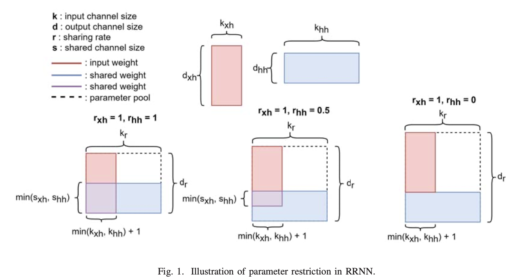
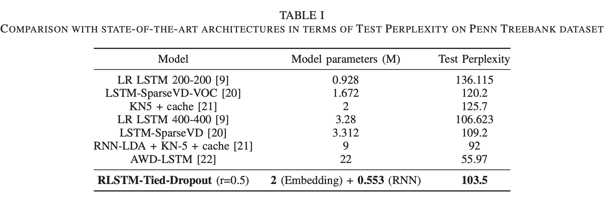

### 1. SkipNet: Learning Dynamic Routing in Convolutional Networks

**Year**: 2018

**Authors**: Xin Wang and Fisher Yu and Zi-Yi Dou and Joseph Gonzalez

**Gist**:  
The authours suggest learning to skip convolutional layers on a
per-input basis.  They introduce SkipNet with a hybrid learning algorithm that combines supervised learning and reinforcement learning to address the challenges of non-differentiable skipping decisions. 

**Results**:

**Tags**: ResNet, CIFAR-10, CIFAR-100, SVHN, FLOPS reduction.

### 2. Restricted Recurrent Neural Networks

**Year**: 2019

**Authors**: Diao, Enmao and Ding, Jie and Tarokh, Vahid

**Gist**:  Restricted Recurrent Neural Network (RRNN), restricts the weight matrices corresponding to the input data and hidden states at each time step to share a large proportion of parameters. The new architecture can be regarded as a compression of its classical counterpart, but it does not require pre-training or sophisticated parameter fine-tuning, both of which are major issues in most existing compression techniques.

**Results**:

**Tags**: RestrPenn treebank dataset, wikitext2 dataset, RNN, GRU

### 

**Year**: 

**Authors**: 

**Gist**:  

**Results**: 

**Tags**: 