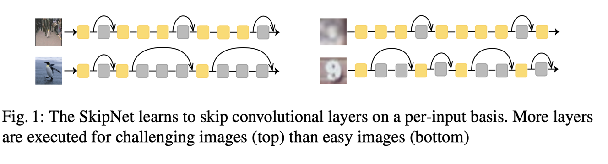
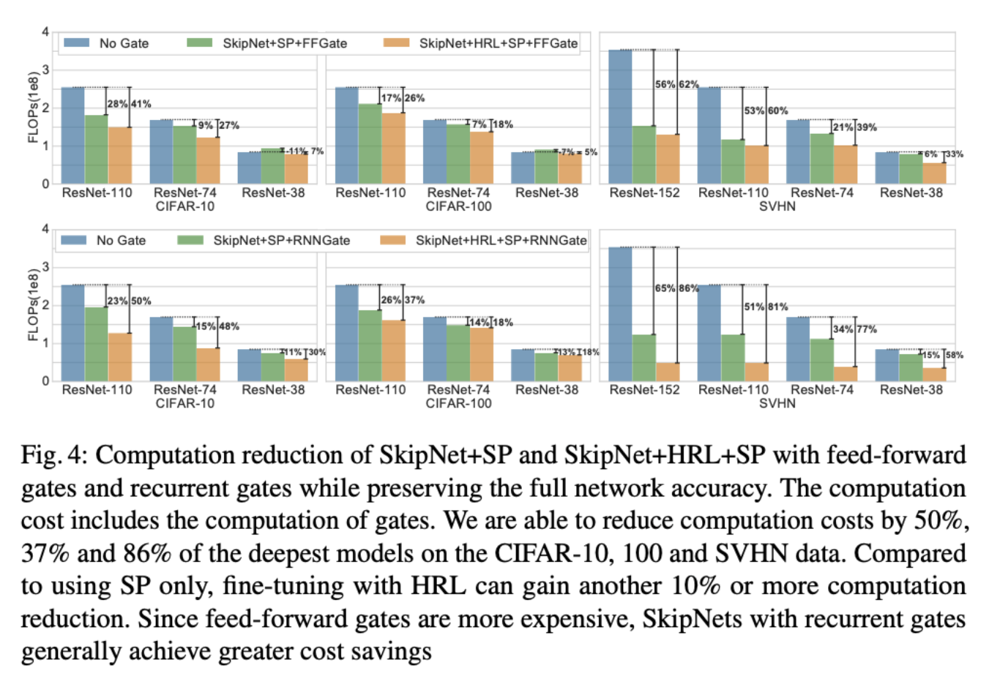

### 1. SkipNet: Learning Dynamic Routing in Convolutional Networks

**Year**: 2018

**Authors**: Xin Wang and Fisher Yu and Zi-Yi Dou and Joseph Gonzalez

**Gist**:  
The authours suggest learning to skip convolutional layers on a
per-input basis.  They introduce SkipNet with a hybrid learning algorithm that combines supervised learning and reinforcement learning to address the challenges of non-differentiable skipping decisions. 

**Results**:

**Tags**: ResNet, CIFAR-10, CIFAR-100, SVHN, FLOPS reduction.

### Name

**Year**: 

**Authors**: 
**Gist**:  

**Results**:

**Tags**: 