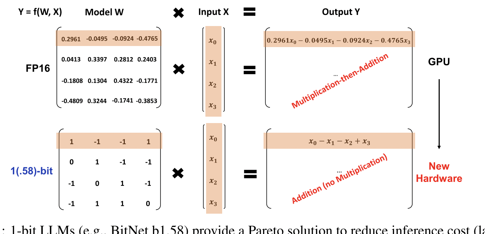
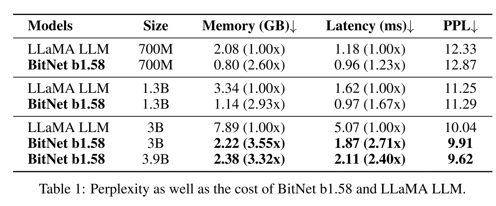
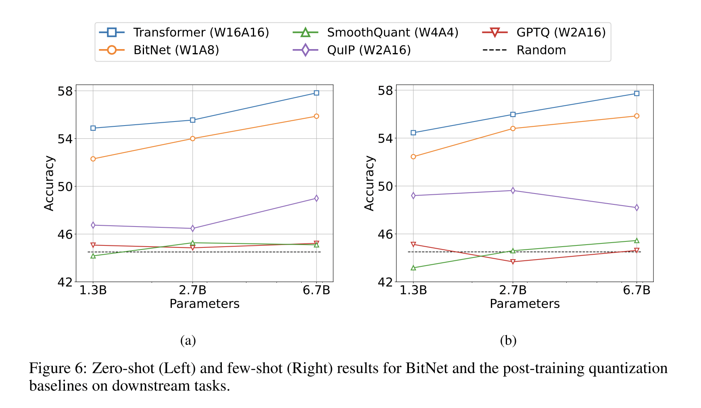
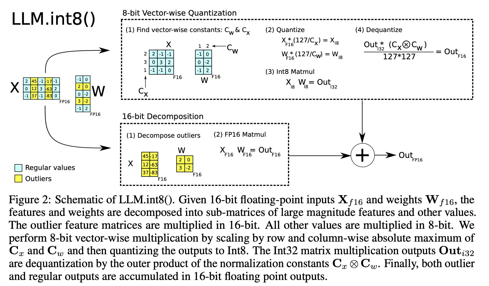
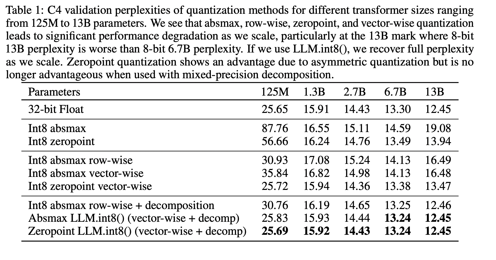

# Quantization

### The Era of 1-bit LLMs: All Large Language Models are in 1.58 Bits

**Year**: 2024

**Authors**: Shuming Ma, Hongyu Wang, Lingxiao Ma Lei Wang Wenhui Wang, Shaohan Huang Li Dong Ruiping Wang Jilong Xue Furu Wei⋄

**Gist**:
From the article itself, the details of training are not clear at all, except that they train from-scratch and ternarize weights using the absmax method.
But there is clarification in the previous article of this team https://arxiv.org/pdf/2310.11453.pdf:
- They teach quantization-aware: the behavior of the network is emulated if it were quantized at the moment, that is, conversion to quantized values is assigned to real weights. With forward pass, the weights are binarized (in the new article they are ternarized), activations have reduced accuracy. With backward pass, the weights are updated to full precision.
- For quantization, absmax is used, which was proposed in 2022 https://arxiv.org/pdf/2208.07339.pdf.
- They suggest using a higher learning rate (8e-4). Since the weights during ternarization change little on each backward pass.

**Results**:

**Tags**: QAT, ternarization.

### BitNet: Scaling 1-bit Transformers for Large Language Models

**Year**: 2023

**Authors**: Hongyu Wang, Shuming Ma, Li Dong† Shaohan Huang, Huaijie Wang, Lingxiao Ma, Fan Yang, Ruiping Wang, Yi Wu, Furu Wei

**Gist**:
- The authors teach quantization-aware: the behavior of the network is emulated if it were quantized at the moment, that is, conversion to quantized values is assigned to real weights. With forward pass, the weights are binarized (in the new article they are ternarized), activations have reduced accuracy. With backward pass, the weights are updated to full precision.
- For quantization, absmax is used, which was proposed in 2022 https://arxiv.org/pdf/2208.07339.pdf.
- They suggest using a higher learning rate (8e-4). Since the weights during ternarization change little on each backward pass.

**Results**:

**Tags**:

### 11. LLM.int8(): 8-bit Matrix Multiplication for Transformers at Scale

**Year**: 2022

**Authors**: Tim Dettmers, Mike Lewis† Younes Belkada, Luke Zettlemoyer

**Gist**: The authors develop a procedure for Int8 matrix multiplication for feed-forward and attention projection layers in transformers. They first use vector-wise quantization with separate normalization constants for each inner product in the matrix multiplication, to quantize most of the features. However, for the emergent outliers, the authors also include a new mixed-precision decomposition scheme, which isolates the outlier feature dimensions into a 16-bit matrix multiplication while still more than 99.9% of values are multiplied in 8-bit.

**Results**: 

**Tags**: Quantization, 8-int, 16-bit multiplication.

### Name

**Year**: 

**Authors**:

**Gist**:

**Results**:

**Tags**: