# Structured pruning

### 1. Adaptive Activation-based Structured Pruning

**Year**: 2023

**Authors**: Kaiqi Zhao, Animesh Jain, Ming Zhao

**Gist**: 
The authors propose adaptive pruning algorthm. It is suggested to  iteratively remove weights less than calculated treshhold and train pruned network on T - k epochs. If new network is better regarding to choosen criteria (FLOPS/size/accuracy drop), we update weight. Otherwise, return to previous weights and set new threshold.

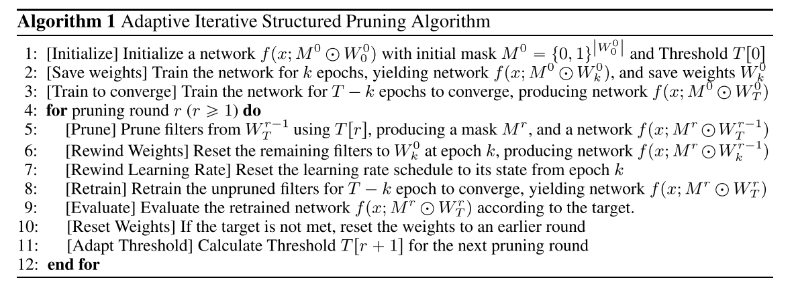

**Results**:

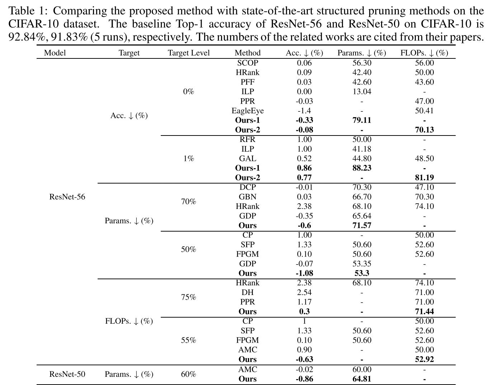

**Tags**: Iterative pruning, structured pruning, ResNet, VGG, MobileNet, CIFAR, Tiny-ImageNet

### 2. ON THE ROLE OF STRUCTURED PRUNING FOR NEURAL NETWORK COMPRESSION

**Year**: 2021

**Authors**: Andrea Bragagnolo, Enzo Tartaglione, Attilio Fiandrotti, Marco Grangetto

**Gist**: The authors compared performance of structured (SeReNe) and unstructured (LOBSTER) pruning on different devices. The result of the experiments is that structured pruning enables better end-to-end compression despite lower pruning ratios.

**Results**:

**Tags**: Structured pruning, instructured pruning, SeReNe, LOBSTER, VGG, ResNet, CIFAR, ImageNet

### 3. Parameterized Structured Pruning for Deep Neural
Networks

**Year**: 2019

**Authors**: Günther Schindler, Wolfgang Roth, Franz Pernkopf, and Holger Fröning

**Gist**:
Authours consider only column, filter and layer pruning. They suggest to add parameter $\nu$ of size (number of columns in layer for column pruning, number of filters in layer for filter pruning, one number for layer pruning). On each forward we collect gradients for weights, on the backward pass we don't change weights, but $\nu$. Gradient for $\nu$ is calculates as a sum of gradients in column/filter/layer. If the gradient sum is less than certain number $\epsilon$, $\nu$ gradient equals zero. To force $\nu$ to be zero in gradient update l1 regularization was added.

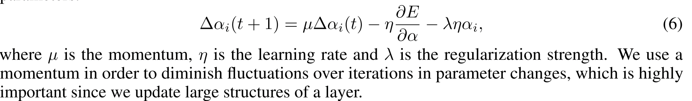

**Results**:

**Tags**: (~) Iterative pruning, CIFAR, structured pruning, ResNet, DenseNet, CIFAR

### 4. Revisiting Loss Modelling for Unstructured Pruning

**Year**: 2020

**Authors**: César Laurent, Camille Ballas, Thomas George, Nicolas Ballas, Pascal Vincent

**Gist**: Authors propose linear (LM) and quadratic criterions (QM) for unstructured iterative pruning. They suggest to apply this criterions instead of  optimal brain damage criterion (OBD). Finetuning is optional.

**Results**:

**Tags**: Unstructured pruning, MNIST, CIFAR, VGG, Pruning criterions

### 5. A Closer Look at Structured Pruning for Neural Network Compression

**Year**: 2018

**Authors**: Elliot J. Crowley, Jack Turner, Amos Storkey, Michael O’Boyle

**Gist**: l1 norm and fisher pruning. The authors compare pruned and finetuned models with reduced networks (by depth or width) and network with fisher pruning structure trained from scratch. Models trained from scratch show better performance, fisher scratch is the best.

**Results**:

DenseNet TestError:

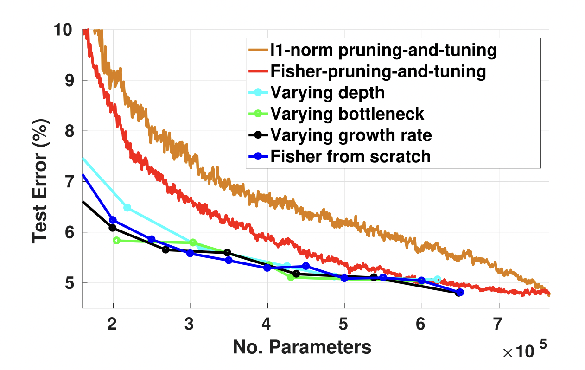

**Tags**: Fisher pruning, structured pruning, DenseNet

### 6. Group Fisher Pruning for Practical Network Compression

**Year**: 2021

**Authors**: Liyang Liu, Shilong Zhang, Zhanghui Kuang, Aojun Zhou, Jing-Hao Xue, Xinjiang Wang, Yimin Chen, Wenming Yang, Qingmin Liao, Wayne Zhang

**Gist**: 
1. Pruning of coupled channels (like in pyramid network). If two layers recevie info from one conv, they are coupled. If parent conv is pruned, coupled convs should be pruned accordingly. 
2. it prunes globally rather than locally. 
3. it estimates importances of all channels in one pass via the principled Fisher information instead of multiple forward passes for individual channels
4. it does not depend on specific layers like batch normalization (BN) and thus is more general.

**Results**:

**Tags**: Structured pruning, ImageNet.

### 7. ThiNet: A Filter Level Pruning Method for Deep Neural Network Compression

**Year**: 2017

**Authors**: Jian-Hao Luo, Jianxin Wu, and Weiyao Lin

**Gist**: The authors propose the method of iterative channel pruning. Their method includes choosing weak channels in a layer $i$ based on input values in a layer $i+1$. The subset of weak channels in layer $i$ is defined by a greedy algorithm. Then weak channels are removed from layer $i$. The remaining channels are multiplied by weights given by minimization of construction loss between $i+1$ output before pruning and after pruning. Afterwards, the network is finetuned. Such operation is performed for each layer.

**Results**:

**Tags**: VGG, ResNet, ImageNet, Iterative pruning, Structured Pruning

### 8. RETHINKING THE VALUE OF NETWORK PRUNING

**Year**: 2018

**Authors**: Zhuang Liu, Mingjie Sun, Tinghui Zhou, Gao Huang, Trevor Darrell

**Gist**: The authours claims that common beliefs about pruning are not necessarily true:
- it is believed that starting with training a large, over-parameterized network is important. 
- both the pruned architecture and its associated weights are believed to be essential for obtaining the final efficient model.  

Instead, their results suggest that the value of automatic pruning algorithms may lie in identifying efficient structures and performing implicit architecture search, rather than selecting “important” weights.
It is suggested to compare existing pruning tehniques and models, which have the same pruning rate, but trained from scratch. These models (Scratch-E and Scratch-B) are trained on the same number of epochs and trained with the same FLOPS amount correspondingly.

**Results**:

**Tags** Structured pruning, ImageNet, CIFAR, VGG, ResNet.

### 9. Structured Pruning Adapters

**Year**: 2023

**Authors**: Lukas Hedegaard, Aman Alok, Juby Jose, Alexandros Iosifidis

**Gist**: 
The authors proposed Structured Pruning Adapters (SPAs) as an alternative to fine-tuning during structured pruning. Instead of updating all model weights, SPAs consist of prunable lightweight add-on modules, which are learned in place of the original weights but can be fused with them at runtime to obtain the same computational enhancements as regular structured pruning with fine-tuning. The SPA was applied to transfer-learning tasks.

**Results**:

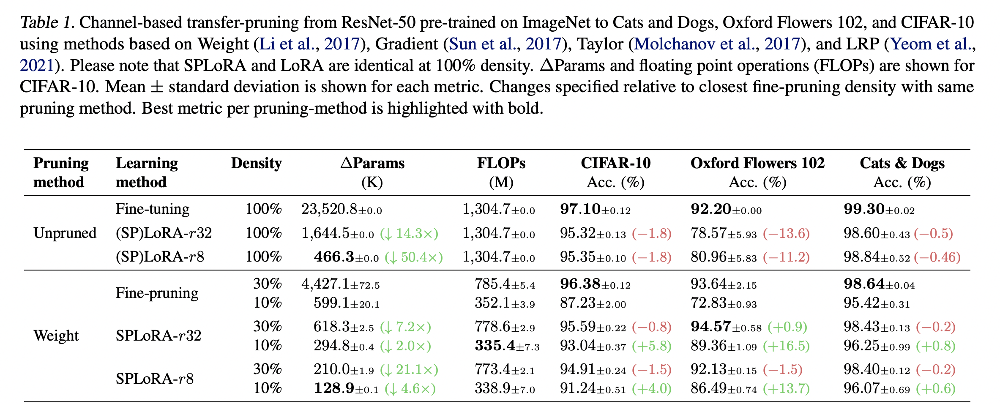

**Tags**: CIFAR, ResNet, Weight Pruning, Gradient Pruning, Taylor Pruning, LRP, Structural Pruning

### 10. WHAT MATTERS IN THE STRUCTURED PRUNING OF GENERATIVE LANGUAGE MODELS?

**Year**: 2023

**Authors**: Michael Santacroce, Yelong Shen, Zixin Wen, Yuanzhi Li

**Gist**:
It was found that existing pruning methods have the same performance as the best established methods for decoder-only LLMs.
Th authours propose an empirical analysis framework for structured pruning that relies on two fundamental measures of redundancy: sensitivity and uniqueness. The authors provide Globally Unique Movement (GUM) method, that aims to maximize both sensitivity and uniqueness by pruning network components. It was found that distillation largely closes the gaps between different methods, further narrowing the advantage of best methods over random pruning.

**Results**:

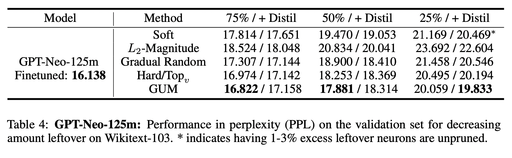

**Tags**: Structural pruning, LLM, decoder, pruning metrics.

### 11. Pruning by explaining: A novel criterion for deep neural network pruning

**Year**: 2021

**Authors**: Seul-Ki Yeom, Philipp Seegerer, Sebastian Lapuschkin, Alexander Binder, Simon Wiedemann, Klaus-Robert M¨uller, Wojciech Samek

**Gist**: The article proposes a novel criterion for the iterative pruning of convolutional neural networks (CNNs) using the explanation method LRP, which links two previously disconnected research areas. LRP assigns relevance scores to individual network units, allowing for efficient compression rates by removing units with low scores without sacrificing predictive performance. Experiments demonstrate that the LRP criterion achieves favorable compression performance across various datasets, especially in transfer learning settings with small target datasets. Additionally, LRP can be used for visual interpretation of the model, providing intuitive relevance heatmaps to explain individual decisions and potentially avoid undesired phenomena during the pruning process.

The relevance on a forward pass:

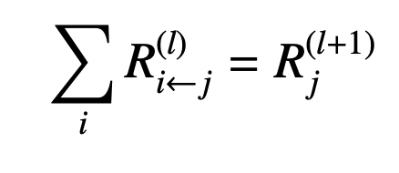

The relevance on a backward pass:

**Results**:

Results with fine-tuning.

Results w/o finetuning.

**Tags**: Pruning, Layer-wise Relevance Propagation (LRP), Iterative pruning, VGG, ResNet, ILSVRC, Cats and Dogs,

### 12. To prune, or not to prune: exploring the efficacy of pruning for model compression

**Year**: 2017

**Authors**: Michael H. Zhu, Suyog Gupta

**Gist**: The authors demonstrate that large-sparse models outperform comparably-sized small-dense models across a diverse set of neural network architectures. They also present a gradual pruning technique based on weight magnitude.

**Results**:

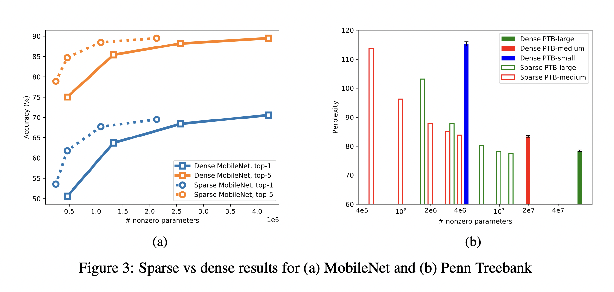

**Tags**: Unstructured pruning, gradual pruning, iterative pruning, LSTM.

### 13. THE LOTTERY TICKET HYPOTHESIS: FINDING SPARSE, TRAINABLE NEURAL NETWORKS

**Year**: 2019

**Authors**: Jonathan Frankle, Michael Carbin

**Gist**: The Lottery Ticket Hypothesis. A randomly-initialized, dense neural network contains a subnetwork that is initialized such that—when trained in isolation — it can match the test accuracy of the original network after training for at most the same number of iterations. Returning to initial weights (before training) is crutial.

**Results**: 

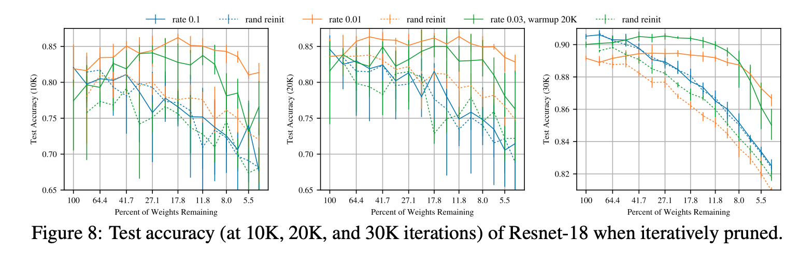

**Tags**: Unstructured pruning, iterative pruning, ResNet-18, VGG-16

### 14. COMPARING REWINDING AND FINE-TUNING IN NEURAL NETWORK PRUNING

**Year**: 2020

**Authors**: Alex Renda and Jonathan Frankle and Michael Carbin

**Gist**: In this paper, we compare fine-tuning to alternative
retraining techniques. Weight rewinding (as proposed by Frankle et al. (2019)),
rewinds unpruned weights to their values from earlier in training and retrains
them from there using the original training schedule. Learning rate rewinding
(which we propose) trains the unpruned weights from their final values using
the same learning rate schedule as weight rewinding. Both rewinding techniques
outperform fine-tuning, forming the basis of a network-agnostic pruning algorithm
that matches the accuracy and compression ratios of several more network-specific
state-of-the-art techniques.

**Results**:

**Tags**: ResNet, CIFAR-10, ImageNet, GNMT, WMT16, Structured and Unstructured pruning, One shot pruning, Iterative pruning

### 15. Movement Pruning: Adaptive Sparsity by Fine-Tuning

**Year**: 2020

**Authors**: Victor Sanh and Thomas Wolf and Alexander M. Rush

**Gist**:  

Updating score function by forward-backward pass, mask for pruning is based on score-metrix.

The authors propose iterative gradient based movement pruning. The pruning mask filter Top_s weights or weights with score S > \tau. Score functionis updated during transfer learning. Pruning mask are applied during transfer learning too. The pruning technique was applied to transformer-based network.

**Results**:

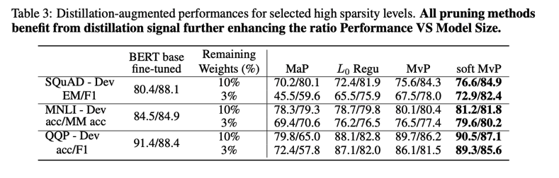

**Tags**: Unstructuredd pruning, iterative pruning.

### 16. Pruning Convolutional Neural Networks for Resource Efficient Transfer Learning

**Year**: 2016

**Authors**: Pavlo Molchanov and Stephen Tyree and Tero Karras and Timo Aila and Jan Kautz

**Gist**:  
The authors find: 
1) CNNs may be successfully pruned by iteratively removing the least important parameters—feature maps in this case—according to heuristic selection criteria; 
2) a Taylor expansion-based criterion demonstrates significant improvement over other criteria; 
3) per-layer normalization of the criterion is important to obtain global scaling.

**Results**: 

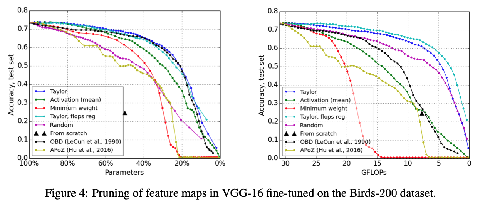

**Tags**: Structureal pruning, Iterative pruning, Taylor, AlexNet, recurrent 3D-CNN, Flowers, Birds, VGG-16, ImageNet, fine-tuning.

### 17. Compressing BERT: Studying the Effects of Weight Pruning on Transfer Learning

**Year**: 2020

**Authors**: Mitchell A. Gordon and Kevin Duh and Nicholas Andrews

**Gist**:  
We find that pruning affects transfer learning in three broad regimes. Low levels of pruning (30-40%) do not affect pre-training loss or transfer to down- stream tasks at all. Medium levels of pruning increase the pre-training loss and prevent use- ful pre-training information from being trans- ferred to downstream tasks. High levels of pruning additionally prevent models from fit- ting downstream datasets, leading to further degradation. Finally, we observe that fine- tuning BERT on a specific task does not im- prove its prunability. We conclude that BERT can be pruned once during pre-training rather than separately for each task without affecting performance.

“Information deletion” - prune network, but unfreeze zeroed weights while transfer learning.

**Results**:

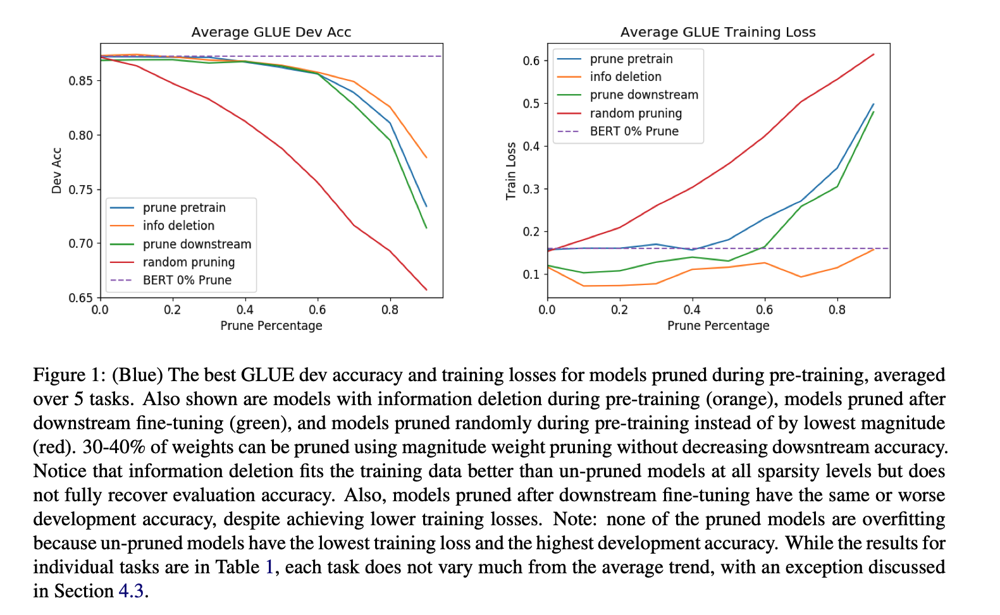

**Tags**: Iterative pruning, magnitude-based pruning, local pruning, structured pruning, BERT, GLUE

### 18. PackNet: Adding Multiple Tasks to a Single Network by Iterative Pruning

**Year**: 2017

**Authors**: Arun Mallya and Svetlana Lazebnik

**Gist**:  
In this work, we have presented a method to “pack” multiple tasks into a single network with minimal loss of performance on prior tasks. The proposed method allows us to modify all layers of a network and influence a large number

of filters and features, which is necessary to obtain accuracies comparable to those of individually trained networks for each task. 

**Results**:

**Tags**: Unstructured pruning, structured pruning (poor results), VGG-16, ResNet-50, DenseNet.

### 19. Parameter-Efficient Transfer Learning with Diff Pruning

**Year**: 2020

**Authors**: Demi Guo and Alexander M. Rush and Yoon Kim
**Gist**:  
The authors want to minimize the number of parameters for the new task. The number of parameters of initial network remains the same. Additional vector, which is trained while transfer learning, is pruned by L1 regularization.

**Results**:

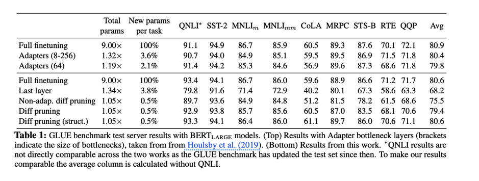

**Tags**: Unstructured pruning, structured pruning, BERT, GLUE, transfer learning.

### 20. Activation-Based Pruning of Neural Networks

**Year**: 2024

**Authors**: Tushar Ganguli, and Edwin K. P. Chong

**Gist**: Activation-based pruning for fully-conected networks. The technique is based on he number of times each neuron is activated during model training. Proposed algorithm was compared with magnitued-based pruning and low-rank matrix approximation based on PCA.

**Results**:

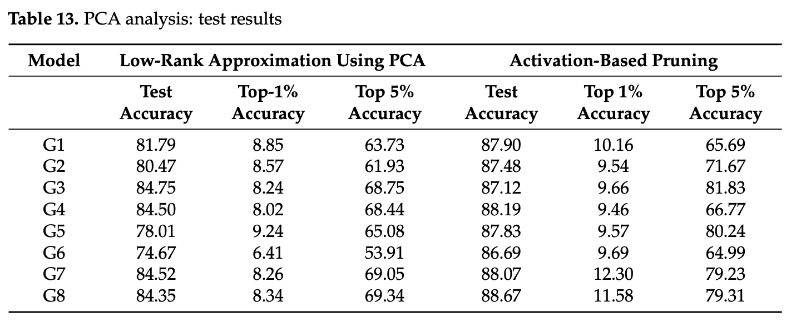

**Tags**: MNIST, FashionMNIST, local pruning, global pruning, structures, unstructured pruning, 

### 21. Automatic Block-wise Pruning with Auxiliary Gating Structures for Deep Convolutional Neural Networks

**Year**: 2022

**Authors**: 
**Gist**:  In this paper authors proposed an automatic block-wise pruning schedule for CNNs using gating modules (from SkipNet paper). 

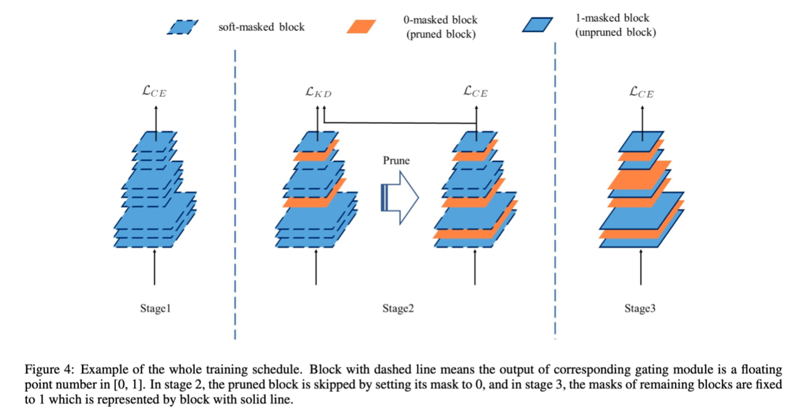

**Results**:

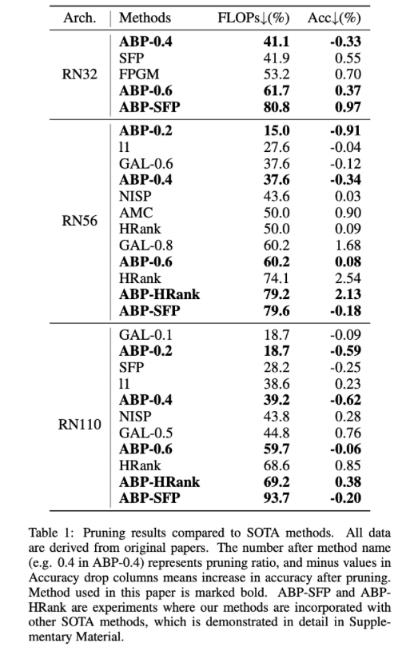

**Tags**: Structural pruning, block pruning, gated pruning, pruning schedule, ResNet-32, Resnet-56, ResNet-110, CIFAR-10, CIFAR-100.

### 22. PRUNING COMPACT CONVNETS FOR EFFICIENT INFERENCE

**Year**: 2023

**Authors**: Sayan Ghosh, Karthik Prasad, Xiaoliang Dai, Peizhao Zhang, Bichen Wu, Graham Cormode, Peter Vajda

**Gist**:  
In this paper, we have investigated the problem of improving on the current state-of-the-art FLOPs vs. performance trade-off for FBNets which have been pre-optimized by NAS (Neural Architecture Search). We have employed network pruning techniques, and our results demonstrate that we can further improve on performance over FBNetV3 at a given FLOPs target through global as well as uniform magnitude-based pruning. This happens not only for relatively over-parameterized networks such as FBNetV3G, but also smaller networks such as FBNetV3A which have lower computational complexity. On average, the GPU-hours incurred during pruning is about ∼ 4× less than that consumed by a full-scale NAS.

**Results**:

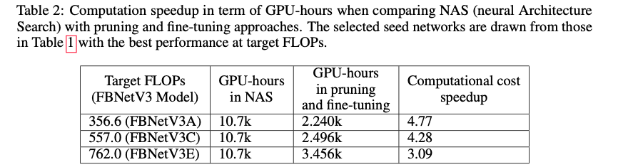

**Tags**: ImageNet, FBNet, unstructured pruning.

### 23. An End-to-End Network Pruning Pipeline with Sparsity Enforcement

**Year**: 2023

**Authors**: 
**Gist**:  The authours use the ZerO initialization (from paper "Zero initialization: Initializing neural networks with only zeros and ones") and learn sparsity matrix (matrix is a probablity of zeroing the weight. Also regularizations of the sparsity matrices are added in a loss). On a post-training phase, where sparcity matrices are fixed, it is proposed to use label smoothing, soft activations and soft skip-connections to improve training of the sparse model.

**Results**: 

**Tags**: Unstructured pruning, fine-tuning, VGG-16, MLP, MNIST, CIFAR-10.

### 24. SNIP: Single-shot Network Pruning based on Connection Sensitivity

**Year**: 2018

**Authors**: Namhoon Lee and Thalaiyasingam Ajanthan and Philip H. S. Torr

**Gist**:  The authors presented SNIP that prunes irrelevant connections for a given task at single-shot prior to training. SNIP identifies the least important connections by calculating  normed gradients with respect to the connections on a batch.

**Results**:

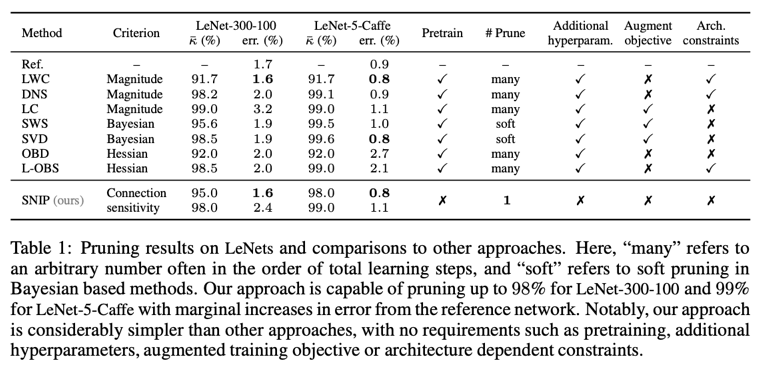

**Tags**: Unstructured pruning, gradient-based pruning, sensetivity, LeNet, MNIST, Fashion-MNIST, foresight pruning.

### 25. PICKING WINNING TICKETS BEFORE TRAINING BY PRESERVING GRADIENT FLOW

**Year**: 2020

**Authors**: Chaoqi Wang, Guodong Zhang, Roger Grosse

**Gist**:  
We propose Gradient Signal Preservation (GraSP) that aims to preserve the gradient flow through the network after pruning. It can also be interpreted as aligning the large eigenvalues of the Neural Tangent Kernel with the targets. GraSP is able to prune the weights of a network at initialization

**Results**:

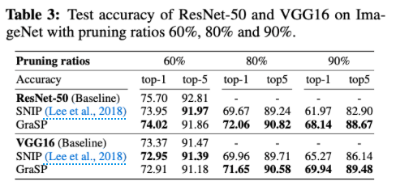

**Tags**: Unstructured pruning, VGG-16, ResNet-50, ImageNet, ResNet-32, CIFAR-10, CIFAR-100, gradient-based pruning, pruning without fine-tuning, foresight pruning. 

### 26. Pruning neural networks without any data by iteratively conserving synaptic flow

**Year**: 2020

**Authors**: Hidenori Tanaka and Daniel Kunin and Daniel L. K. Yamins and Surya Ganguli
**Gist**:  
In this paper, we developed a unifying theoretical framework that explains why existing single-shot pruning algorithms at initialization suffer from layer-collapse (layer without weights). We applied our framework to elucidate how iterative magnitude pruning  overcomes layer-collapse to identify winning lottery tickets at initialization. We designed a new data-agnostic pruning algorithm, SynFlow, that provably avoids layer-collapse and reaches Maximal Critical Compression.

**Results**: 

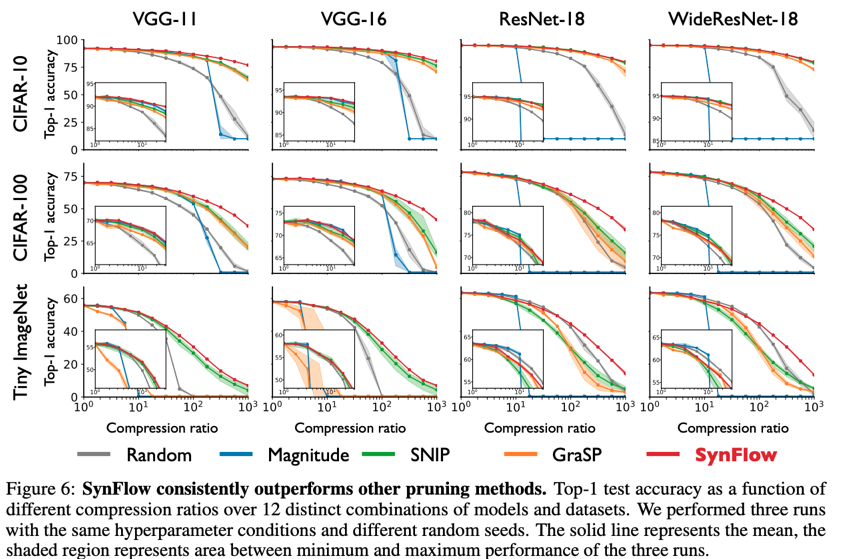

**Tags**: Unstructured pruning, VGG-11, VGG-16, ResNet-50, Tiny ImageNet, ResNet-18, WideResNet-18, CIFAR-10, CIFAR-100, gradient-based pruning, pruning without fine-tuning, foresight pruning.

### 27. Training Your Sparse Neural Network Better with Any Mask
**Year**: 2022

**Authors**: Ajay Jaiswal and Haoyu Ma and Tianlong Chen and Ying Ding and Zhangyang Wang

**Gist**:  We provide a curated and easily adaptable training toolkit (ToST) for training ANY sparse mask from scratch: “ghost” skip-connection (injecting additional non-existent skip-connections in the sparse masks),“ghost” soft neurons (changing the ReLU neurons into smoother activation functions such as Swish (Ramachandran et al., 2017) and Mish (Misra, 2019)), as well as modifying initialization and labels.

**Results**: 

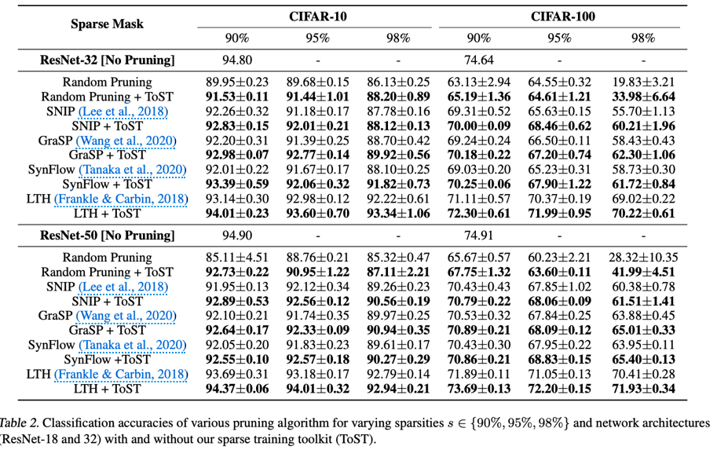

**Tags**: Unstructured pruning, foresight pruning, ResNet-32, ResNet-50, CIFAR-10, CIFAR-100, TinyImageNet. 

### 28. Training Sparse Neural Networks
**Year**: 2016

**Authors**: Suraj Srinivas and Akshayvarun Subramanya and R. Venkatesh Babu
**Gist**:  
We introduce additional gate variables to perform parameter selection and show that this is equivalent to using a spike-and-slab prior.

**Results**:

**Tags**: Unstructured pruning, spike-and-slab prior, LeNet-5, VGG-16, AlexNet, MNIST, ILSVRC-2012

### 29. Fast as CHITA: Neural Network Pruning with Combinatorial Optimization

**Year**: 2023

**Authors**: Riade Benbaki and Wenyu Chen and X. Meng and Hussein Hazimeh and Natalia Ponomareva and Zhe Zhao and Rahul Mazumder
**Gist**:  
In this work we have presented an efficient network pruning
framework CHITA , which is based on a novel, hessian-free l0-constrained regression formulation and combina-
torial optimization techniques. Single-stage method: CHITA. Multi-stage CHITA++ (iterative pruning).

**Results**:

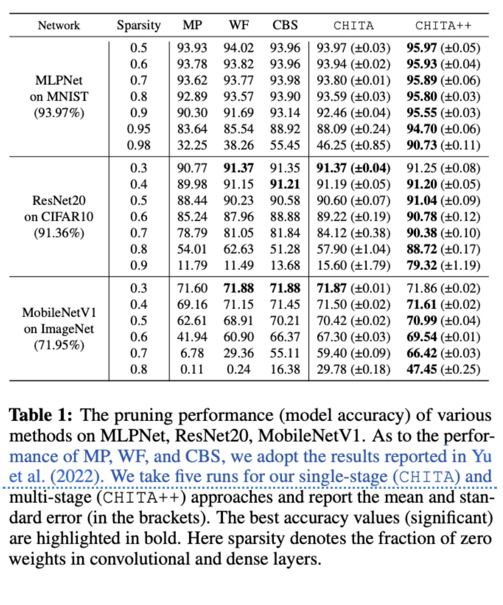

**Tags**: Unstructured pruning, iterative pruning, one-stage pruning, MLP, MNIST, ResNet20, MobileNetV1, CIFAR-10, ImageNet.

### 30. Neural Networks at a Fraction with Pruned Quaternions

**Year**: 2023

**Authors**: Sahel Mohammad Iqbal and Subhankar Mishra

**Gist**:  The authots propose to use quaternions instead of real weights and Hamilton multiplication that reduces the number of weights in comparance with the real-networks. Additionnaly, authors compared real pruned models and quaternoin pruned models. 

**Results**:

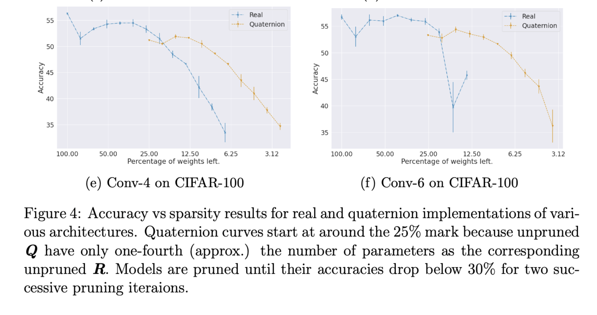

**Tags**: Unstructured pruning, quaternions, MNIST, CIFAR-10, CIFAR-100, Conv-4, Conv-6, Lenet-300-100.

### 31. Prospect Pruning: Finding Trainable Weights at Initialization using Meta-Gradients

**Year**: 2022

**Authors**: 
**Gist**:  In this paper, we propose Prospect Pruning (ProsPr), a  pruning-at-init method that learns from the first few steps of optimization which parameters to prune. ProsPr uses meta-gradients by backpropagating through the first few model updates in order to estimate the effect the initial pruning parameters have on the loss after a few gradient descent steps.

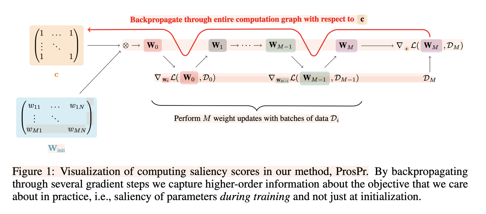

**Results**:

**Tags**: Unstructured pruning, foresight pruning, pruning-at-init, CIFAR-10, CIFAR-100, TinyImageNet, ResNet-20, VGG-16, ResNet-18

### 
**Year**: 

**Authors**: 
**Gist**:  

**Results**:

**Tags**: 

- Tocrh Pruning https://github.com/VainF/Torch-Pruning?tab=readme-ov-file
- Diff-Pruning: Structural Pruning for Diffusion Models https://github.com/VainF/Diff-Pruning?tab=readme-ov-file
- LLM-Pruner: On the Structural Pruning of Large Language Models
- SlimSlam https://github.com/czg1225/SlimSAM?tab=readme-ov-file
- DeepCache: Accelerating Diffusion Models for Free https://github.com/horseee/DeepCache
- Sanity Checking pruning https://github.com/JingtongSu/sanity-checking-pruning
- https://www.semanticscholar.org/reader/ee53c9480132fc0d09b1192226cb2c460462fd6d
- NISP https://arxiv.org/pdf/1711.05908.pdf
- Google https://arxiv.org/pdf/1803.03635.pdf
- LC compression https://github.com/UCMerced-ML/LC-model-compression?tab=readme-ov-file
- https://faculty.ucmerced.edu/mcarreira-perpinan/research/LC-model-compression.html
- what is a state of the art https://arxiv.org/pdf/2003.03033.pdf

## Elicit state of the art 

- Prospect Pruning: Finding Trainable Weights at Initialization using Meta-Gradients https://www.semanticscholar.org/paper/Prospect-Pruning%3A-Finding-Trainable-Weights-at-Alizadeh-Tailor/be1210aa1ddbe7d6a654045a5aabbdc2a4827e6f
- When to Prune? A Policy towards Early Structural Pruning https://www.semanticscholar.org/paper/When-to-Prune-A-Policy-towards-Early-Structural-Shen-Molchanov/4b4cf6cc67f23635449e59222c055dfd87ab34bd
- Pruning Neural Networks at Initialization: Why are We Missing the Mark? https://www.semanticscholar.org/paper/Pruning-Neural-Networks-at-Initialization%3A-Why-are-Frankle-Dziugaite/0932abfd0fb90e8a28f7bd195633c9891bfd7ecb
- "Understanding Robustness Lottery": A Comparative Visual Analysis of Neural Network Pruning Approaches https://www.semanticscholar.org/paper/%22Understanding-Robustness-Lottery%22%3A-A-Comparative-Li-Liu/95cb0e5e14679189209d489f8f20145dbec10a2a
- https://arxiv.org/abs/2301.00774
