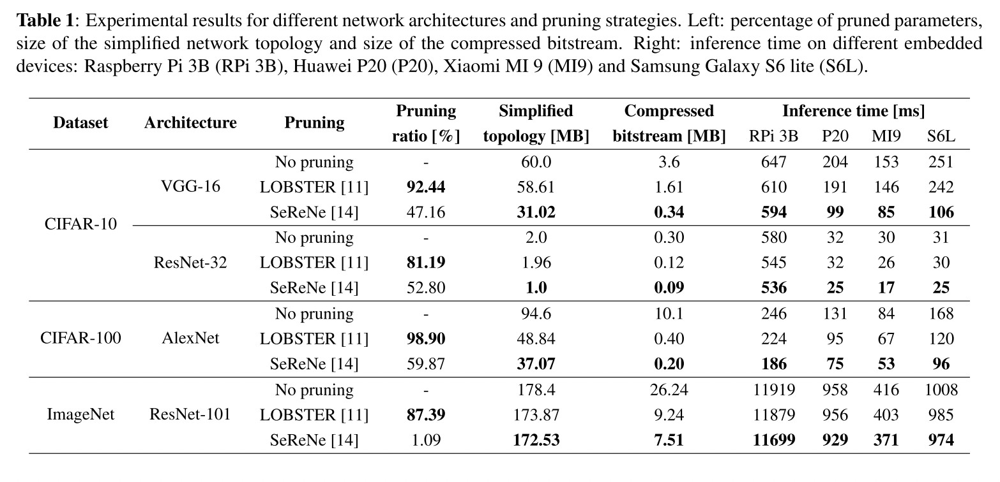
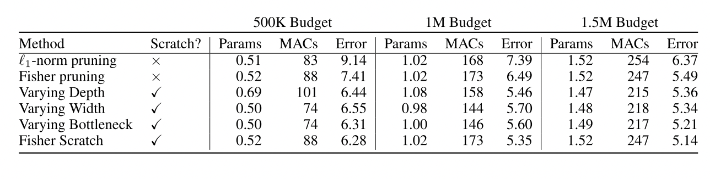
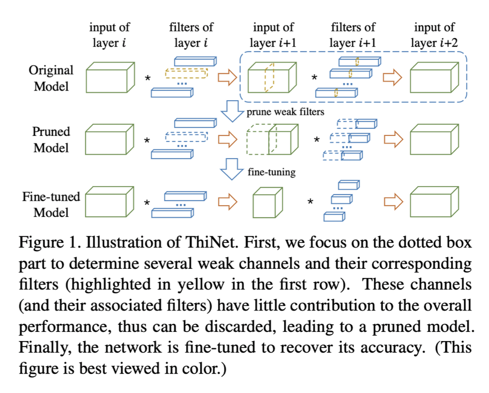
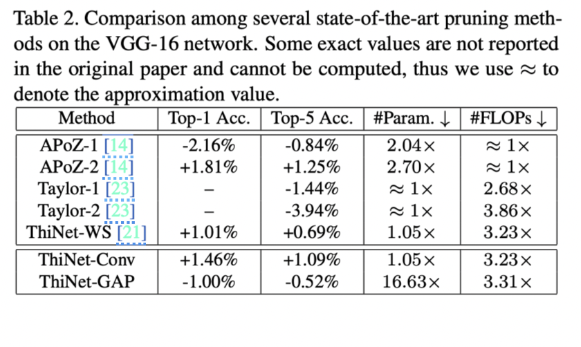
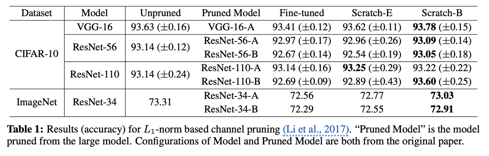
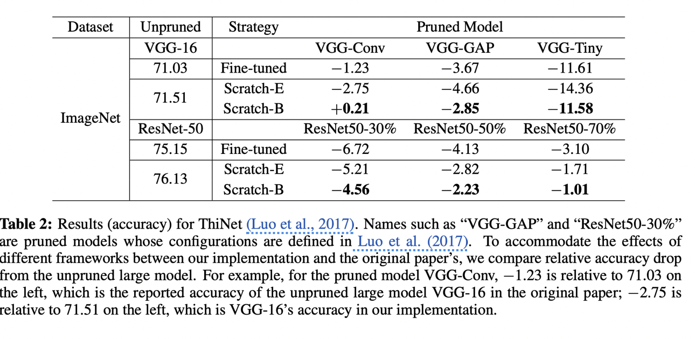
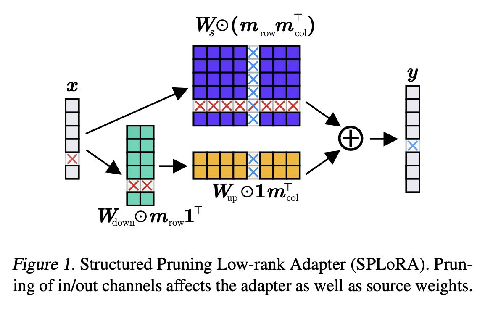
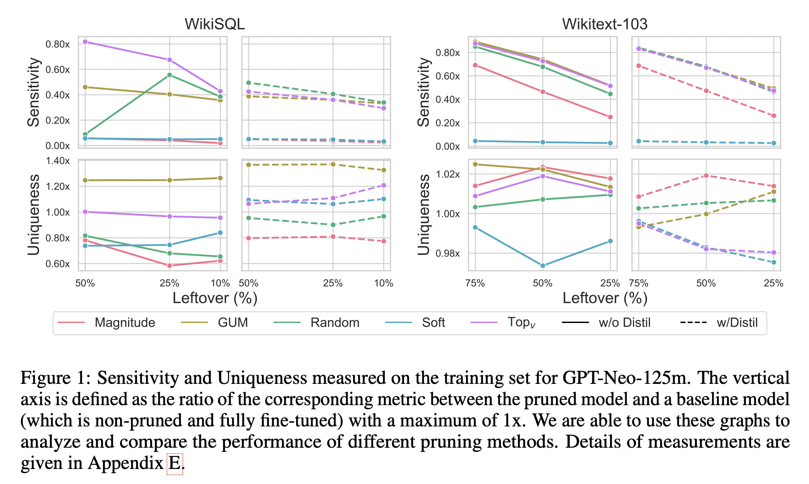
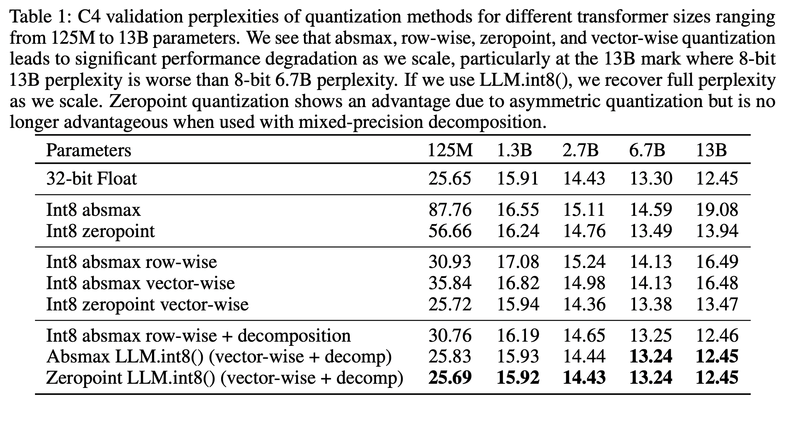
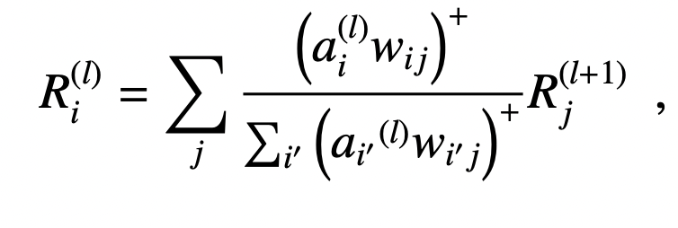

# Structured pruning

### Adaptive Activation-based Structured Pruning

**Year**: 2023

**Authors**: Kaiqi Zhao, Animesh Jain, Ming Zhao

**Gist**: 
The authors propose adaptive pruning algorthm. It is suggested to  iteratively remove weights less than calculated treshhold and train pruned network on T - k epochs. If new network is better regarding to choosen criteria (FLOPS/size/accuracy drop), we update weight. Otherwise, return to previous weights and set new threshold.

**Results**:

**Tags**: Iterative pruning, structured pruning, ResNet, VGG, MobileNet, CIFAR, Tiny-ImageNet

### ON THE ROLE OF STRUCTURED PRUNING FOR NEURAL NETWORK COMPRESSION

**Year**: 2021

**Authors**: Andrea Bragagnolo, Enzo Tartaglione, Attilio Fiandrotti, Marco Grangetto

**Gist**: The authors compared performance of structured (SeReNe) and unstructured (LOBSTER) pruning on different devices. The result of the experiments is that structured pruning enables better end-to-end compression despite lower pruning ratios.

**Results**:

**Tags**: Structured pruning, instructured pruning, SeReNe, LOBSTER, VGG, ResNet, CIFAR, ImageNet

### Parameterized Structured Pruning for Deep Neural
Networks

**Year**: 2019

**Authors**: Günther Schindler, Wolfgang Roth, Franz Pernkopf, and Holger Fröning

**Gist**:
Authours consider only column, filter and layer pruning. They suggest to add parameter $\nu$ of size (number of columns in layer for column pruning, number of filters in layer for filter pruning, one number for layer pruning). On each forward we collect gradients for weights, on the backward pass we don't change weights, but $\nu$. Gradient for $\nu$ is calculates as a sum of gradients in column/filter/layer. If the gradient sum is less than certain number $\epsilon$, $\nu$ gradient equals zero. To force $\nu$ to be zero in gradient update l1 regularization was added.

**Results**:

**Tags**: (~) Iterative pruning, CIFAR, structured pruning, ResNet, DenseNet

### Revisiting Loss Modelling for Unstructured Pruning

**Year**: 2020

**Authors**: César Laurent, Camille Ballas, Thomas George, Nicolas Ballas, Pascal Vincent

**Gist**: Authors propose linear (LM) and quadratic criterions (QM) for unstructured iterative pruning. They suggest to apply this criterions instead of  optimal brain damage criterion (OBD). Finetuning is optional.

**Results**:

**Tags**: Unstructured pruning, MNIST, CIFAR, VGG, Pruning criterions

### A Closer Look at Structured Pruning for Neural Network Compression

**Year**: 2018

**Authors**: Elliot J. Crowley, Jack Turner, Amos Storkey, Michael O’Boyle

**Gist**: l1 norm and fisher pruning. The authors compare pruned and finetuned models with reduced networks (by depth or width) and network with fisher pruning structure trained from scratch. Models trained from scratch show better performance, fisher scratch is the best.

**Results**:

DenseNet TestError:

**Tags**: Fisher pruning, structured pruning, DenseNet

### Group Fisher Pruning for Practical Network Compression

**Year**: 2021

**Authors**: Liyang Liu, Shilong Zhang, Zhanghui Kuang, Aojun Zhou, Jing-Hao Xue, Xinjiang Wang, Yimin Chen, Wenming Yang, Qingmin Liao, Wayne Zhang

**Gist**: 
1. Pruning of coupled channels (like in pyramid network). If two layers recevie info from one conv, they are coupled. If parent conv is pruned, coupled convs should be pruned accordingly. 
2. it prunes globally rather than locally. 
3. it estimates importances of all channels in one pass via the principled Fisher information instead of multiple forward passes for individual channels
4. it does not depend on specific layers like batch normalization (BN) and thus is more general.

**Results**:

**Tags**: Structured pruning, ImageNet.

### ThiNet: A Filter Level Pruning Method for Deep Neural Network Compression

**Year**: 2017

**Authors**: Jian-Hao Luo, Jianxin Wu, and Weiyao Lin

**Gist**: The authors propose the method of iterative channel pruning. Their method includes choosing weak channels in a layer $i$ based on input values in a layer $i+1$. The subset of weak channels in layer $i$ is defined by a greedy algorithm. Then weak channels are removed from layer $i$. The remaining channels are multiplied by weights given by minimization of construction loss between $i+1$ output before pruning and after pruning. Afterwards, the network is finetuned. Such operation is performed for each layer.

**Results**:

**Tags**: VGG, ResNet, ImageNet, Iterative pruning, Structured Pruning

### RETHINKING THE VALUE OF NETWORK PRUNING

**Year**: 2018

**Authors**: Zhuang Liu, Mingjie Sun, Tinghui Zhou, Gao Huang, Trevor Darrell

**Gist**: The authours claims that common beliefs about pruning are not necessarily true:
- it is believed that starting with training a large, over-parameterized network is important. 
- both the pruned architecture and its associated weights are believed to be essential for obtaining the final efficient model.  

Instead, their results suggest that the value of automatic pruning algorithms may lie in identifying efficient structures and performing implicit architecture search, rather than selecting “important” weights.
It is suggested to compare existing pruning tehniques and models, which have the same pruning rate, but trained from scratch. These models (Scratch-E and Scratch-B) are trained on the same number of epochs and trained with the same FLOPS amount correspondingly.

**Results**:

**Tags** Structured pruning, ImageNet, CIFAR, VGG, ResNet.

### Structured Pruning Adapters

**Year**: 2023

**Authors**: Lukas Hedegaard, Aman Alok, Juby Jose, Alexandros Iosifidis

**Gist**: 
The authors proposed Structured Pruning Adapters (SPAs) as an alternative to fine-tuning during structured pruning. Instead of updating all model weights, SPAs consist of prunable lightweight add-on modules, which are learned in place of the original weights but can be fused with them at runtime to obtain the same computational enhancements as regular structured pruning with fine-tuning. The SPA was applied to transfer-learning tasks.

**Results**:

**Tags**: CIFAR, ResNet, Weight Pruning, Gradient Pruning, Taylor Pruning, LRP, Structural Pruning

### WHAT MATTERS IN THE STRUCTURED PRUNING OF GENERATIVE LANGUAGE MODELS?

**Year**: 2023

**Authors**: Michael Santacroce, Yelong Shen, Zixin Wen, Yuanzhi Li

**Gist**:
It was found that existing pruning methods have the same performance as the best established methods for decoder-only LLMs.
Th authours propose an empirical analysis framework for structured pruning that relies on two fundamental measures of redundancy: sensitivity and uniqueness. The authors provide Globally Unique Movement (GUM) method, that aims to maximize both sensitivity and uniqueness by pruning network components. It was found that distillation largely closes the gaps between different methods, further narrowing the advantage of best methods over random pruning.

**Results**:

**Tags**: Structural pruning, LLM, decoder, pruning metrics.

### LLM.int8(): 8-bit Matrix Multiplication for Transformers at Scale

**Year**: 2022

**Authors**: Tim Dettmers, Mike Lewis† Younes Belkada, Luke Zettlemoyer

**Gist**: The authors develop a procedure for Int8 matrix multiplication for feed-forward and attention projection layers in transformers. They first use vector-wise quantization with separate normalization constants for each inner product in the matrix multiplication, to quantize most of the features. However, for the emergent outliers, the authors also include a new mixed-precision decomposition scheme, which isolates the outlier feature dimensions into a 16-bit matrix multiplication while still more than 99.9% of values are multiplied in 8-bit.

**Results**: 

**Tags**: Quantization, 8-int, 16-bit multiplication.

### Name

**Year**: 

**Authors**:

**Gist**: The article proposes a novel criterion for the iterative pruning of convolutional neural networks (CNNs) using the explanation method LRP, which links two previously disconnected research areas. LRP assigns relevance scores to individual network units, allowing for efficient compression rates by removing units with low scores without sacrificing predictive performance. Experiments demonstrate that the LRP criterion achieves favorable compression performance across various datasets, especially in transfer learning settings with small target datasets. Additionally, LRP can be used for visual interpretation of the model, providing intuitive relevance heatmaps to explain individual decisions and potentially avoid undesired phenomena during the pruning process.

The relevance on a forward pass:

The relevance on a backward pass:

**Results**:

Results with fine-tuning.

Results w/o finetuning.

**Tags**: Pruning, Layer-wise Relevance Propagation (LRP), Iterative pruning, VGG, ResNet, ILSVRC, Cats and Dogs,

### To prune, or not to prune: exploring the efficacy of pruning for model compression

**Year**: 2017

**Authors**: Michael H. Zhu, Suyog Gupta

**Gist**: The authors demonstrate that large-sparse models outperform comparably-sized small-dense models across a diverse set of neural network architectures. They also present a gradual pruning technique based on weight magnitude.

**Results**:

**Tags**: Unstructured pruning, gradual pruning, iterative pruning, LSTM.

### Name

**Year**: 

**Authors**:

**Gist**:

**Results**:

**Tags**:

### Name

**Year**: 

**Authors**:

**Gist**:

**Results**:

**Tags**: