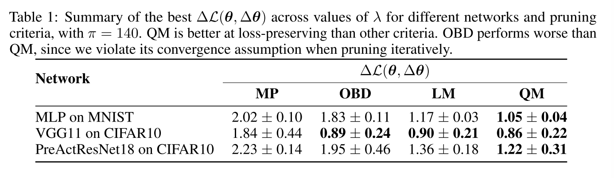
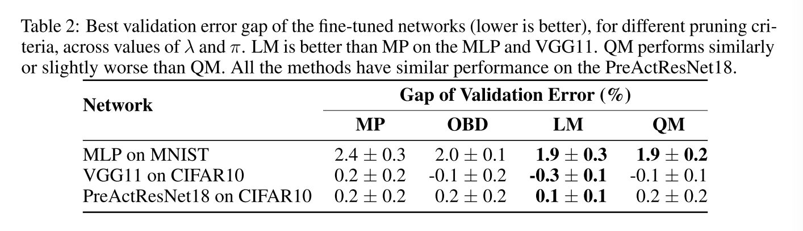

# Structured pruning

### Adaptive Activation-based Structured Pruning

**Year**: 2023

**Authors**: Kaiqi Zhao, Animesh Jain, Ming Zhao

**Gist**: 
The authors propose adaptive pruning algorthm. It is suggested to  iteratively remove weights less than calculated treshhold and train pruned network on T - k epochs. If new network is better regarding to choosen criteria (FLOPS/size/accuracy drop), we update weight. Otherwise, return to previous weights and set new threshold.

**Results**:

**Tags**: Iterative pruning, structured pruning, ResNet, VGG, MobileNet, CIFAR, Tiny-ImageNet

### ON THE ROLE OF STRUCTURED PRUNING FOR NEURAL NETWORK COMPRESSION

**Year**: 2021

**Authors**: Andrea Bragagnolo, Enzo Tartaglione, Attilio Fiandrotti, Marco Grangetto

**Gist**: The authors compared performance of structured (SeReNe) and unstructured (LOBSTER) pruning on different devices. The result of the experiments is that structured pruning enables better end-to-end compression despite lower pruning ratios.

**Results**:

**Tags**: Structured pruning, instructured pruning, SeReNe, LOBSTER, VGG, ResNet, CIFAR, ImageNet

### Parameterized Structured Pruning for Deep Neural
Networks

**Year**: 2019

**Authors**: Günther Schindler, Wolfgang Roth, Franz Pernkopf, and Holger Fröning

**Gist**:
Authours consider only column, filter and layer pruning. They suggest to add parameter $\nu$ of size (number of columns in layer for column pruning, number of filters in layer for filter pruning, one number for layer pruning). On each forward we collect gradients for weights, on the backward pass we don't change weights, but $\nu$. Gradient for $\nu$ is calculates as a sum of gradients in column/filter/layer. If the gradient sum is less than certain number $\epsilon$, $\nu$ gradient equals zero. To force $\nu$ to be zero in gradient update l1 regularization was added.

**Results**:

**Tags**: (~) Iterative pruning, CIFAR, structured pruning, ResNet, DenseNet

### Revisiting Loss Modelling for Unstructured Pruning

**Year**: 2020

**Authors**: César Laurent, Camille Ballas, Thomas George, Nicolas Ballas, Pascal Vincent

**Gist**: Authors propose linear (LM) and quadratic criterions (QM) for unstructured iterative pruning. They suggest to apply this criterions instead of  optimal brain damage criterion (OBD). Finetuning is optional.

**Results**:

**Tags**: Unstructured pruning, MNIST, CIFAR, VGG, Pruning criterions

### A Closer Look at Structured Pruning for Neural Network Compression

**Year**: 2018

**Authors**: Elliot J. Crowley, Jack Turner, Amos Storkey, Michael O’Boyle

**Gist**: l1 norm and fisher pruning. The authors compare pruned and finetuned models with reduced networks (by depth or width) and network with fisher pruning structure trained from scratch. Models trained from scratch show better performance, fisher scratch is the best.

**Results**:

DenseNet TestError:

**Tags**: Fisher pruning, structured pruning, DenseNet

### Group Fisher Pruning for Practical Network Compression

**Year**: 2021

**Authors**: Liyang Liu, Shilong Zhang, Zhanghui Kuang, Aojun Zhou, Jing-Hao Xue, Xinjiang Wang, Yimin Chen, Wenming Yang, Qingmin Liao, Wayne Zhang

**Gist**: 
1. Pruning of coupled channels (like in pyramid network). If two layers recevie info from one conv, they are coupled. If parent conv is pruned, coupled convs should be pruned accordingly. 
2. it prunes globally rather than locally. 
3. it estimates importances of all channels in one pass via the principled Fisher information instead of multiple forward passes for individual channels
4. it does not depend on specific layers like batch normalization (BN) and thus is more general.

**Results**:

**Tags**: Structured pruning, ImageNet.

### Name

**Year**: 

**Authors**:

**Gist**:

**Results**:

**Tags**:

### Name

**Year**: 

**Authors**:

**Gist**:

**Results**:

**Tags**: