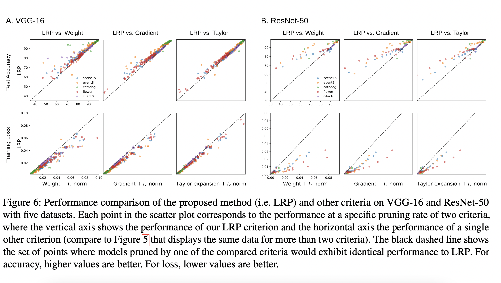
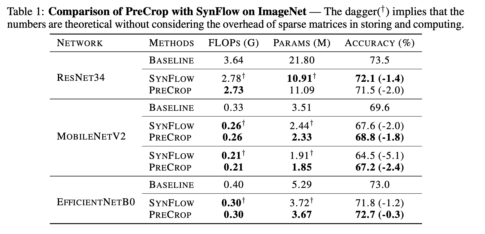

# Structured pruning

### 16. Pruning Convolutional Neural Networks for Resource Efficient Transfer Learning

**Year**: 2016

**Authors**: Pavlo Molchanov and Stephen Tyree and Tero Karras and Timo Aila and Jan Kautz

**Gist**:  
The authors find: 
1) CNNs may be successfully pruned by iteratively removing the least important parameters—feature maps in this case—according to heuristic selection criteria; 
2) a Taylor expansion-based criterion demonstrates significant improvement over other criteria; 
3) per-layer normalization of the criterion is important to obtain global scaling.

**Results**: 

**Tags**: Structureal pruning, Iterative pruning, Taylor, AlexNet, recurrent 3D-CNN, Flowers, Birds, VGG-16, ImageNet, fine-tuning.

### 28. Training Sparse Neural Networks
**Year**: 2016

**Authors**: Suraj Srinivas and Akshayvarun Subramanya and R. Venkatesh Babu
**Gist**:  
We introduce additional gate variables to perform parameter selection and show that this is equivalent to using a spike-and-slab prior.

**Results**:

**Tags**: Unstructured pruning, spike-and-slab prior, LeNet-5, VGG-16, AlexNet, MNIST, ILSVRC-2012

### 41. Pruning Convolutional Neural Networks for Resource Efficient Inference 

**Year**: 2016

**Authors**: Pavlo Molchanov, Stephen Tyree, Tero Karras, Timo Aila, Jan Kautz

**Gist**:  From OpenReview: This paper presents a novel way of pruning filters from convolutional neural networks. The proposed methods is derived from the first order Taylor expansion of the loss change while pruning a particular unit. This leads to simple weighting of the unit activation with its gradient w.r.t. loss function and performs better than simply using the activation magnitude as the heuristic for pruning. This intuitively makes sense, as we would like to remove not only the filters with low activation, but also filters where the incorrect activation value would not have small influence on the target loss.

**Results**:

**Tags**: AlexNet, VGG-16, ImageNet, R3DCNN, Birds-200, Flowers-102, structured pruning, filter pruning.

### 7. ThiNet: A Filter Level Pruning Method for Deep Neural Network Compression

**Year**: 2017

**Authors**: Jian-Hao Luo, Jianxin Wu, and Weiyao Lin

**Gist**: The authors propose the method of iterative channel pruning. Their method includes choosing weak channels in a layer $i$ based on input values in a layer $i+1$. The subset of weak channels in layer $i$ is defined by a greedy algorithm. Then weak channels are removed from layer $i$. The remaining channels are multiplied by weights given by minimization of construction loss between $i+1$ output before pruning and after pruning. Afterwards, the network is finetuned. Such operation is performed for each layer.

**Results**:

**Tags**: VGG, ResNet, ImageNet, Iterative pruning, Structured Pruning

### 12. To prune, or not to prune: exploring the efficacy of pruning for model compression

**Year**: 2017

**Authors**: Michael H. Zhu, Suyog Gupta

**Gist**: The authors demonstrate that large-sparse models outperform comparably-sized small-dense models across a diverse set of neural network architectures. They also present a gradual pruning technique based on weight magnitude.

**Results**:

**Tags**: Unstructured pruning, gradual pruning, iterative pruning, LSTM.

### 18. PackNet: Adding Multiple Tasks to a Single Network by Iterative Pruning

**Year**: 2017

**Authors**: Arun Mallya and Svetlana Lazebnik

**Gist**:  
In this work, we have presented a method to “pack” multiple tasks into a single network with minimal loss of performance on prior tasks. The proposed method allows us to modify all layers of a network and influence a large number

of filters and features, which is necessary to obtain accuracies comparable to those of individually trained networks for each task. 

**Results**:

**Tags**: Unstructured pruning, structured pruning (poor results), VGG-16, ResNet-50, DenseNet.

### 47. NISP: Pruning Networks using Neuron Importance Score Propagation

**Year**: 2017

**Authors**: Ruichi Yu, Ang Li, Chun-Fu Chen, Jui-Hsin Lai, Vlad I. Morariu, Xintong Han, Mingfei Gao, Ching-Yung Lin, Larry S. Davis

**Gist**:  Conclusion: Neuron importance scores in the layer of interest (usually the last layer before classification) are obtained by feature ranking. We formulated the network pruning problem as a binary integer program and obtained a closed-form solution to a relaxed version of the formulation. We presented the Neuron Importance Score Propagation al- gorithm that efficiently propagates the importance to every neuron in the whole network. The network is pruned by re- moving less important neurons and fine-tuned to retain its predicative capability.

**Results**: 

**Tags**: structrured pruning, with fine-tuning, iterative pruning, AlexNet, GoogLeNet, ResNet, ImageNet, CIFAR-10, 

### 5. A Closer Look at Structured Pruning for Neural Network Compression

**Year**: 2018

**Authors**: Elliot J. Crowley, Jack Turner, Amos Storkey, Michael O’Boyle

**Gist**: l1 norm and fisher pruning. The authors compare pruned and finetuned models with reduced networks (by depth or width) and network with fisher pruning structure trained from scratch. Models trained from scratch show better performance, fisher scratch is the best.

**Results**:

DenseNet TestError:

**Tags**: Fisher pruning, structured pruning, DenseNet

### 8. RETHINKING THE VALUE OF NETWORK PRUNING

**Year**: 2018

**Authors**: Zhuang Liu, Mingjie Sun, Tinghui Zhou, Gao Huang, Trevor Darrell

**Gist**: The authours claims that common beliefs about pruning are not necessarily true:
- it is believed that starting with training a large, over-parameterized network is important. 
- both the pruned architecture and its associated weights are believed to be essential for obtaining the final efficient model.  

Instead, their results suggest that the value of automatic pruning algorithms may lie in identifying efficient structures and performing implicit architecture search, rather than selecting “important” weights.
It is suggested to compare existing pruning tehniques and models, which have the same pruning rate, but trained from scratch. These models (Scratch-E and Scratch-B) are trained on the same number of epochs and trained with the same FLOPS amount correspondingly.

**Results**:

**Tags** Structured pruning, ImageNet, CIFAR, VGG, ResNet.

### 24. SNIP: Single-shot Network Pruning based on Connection Sensitivity

**Year**: 2018

**Authors**: Namhoon Lee and Thalaiyasingam Ajanthan and Philip H. S. Torr

**Gist**:  The authors presented SNIP that prunes irrelevant connections for a given task at single-shot prior to training. SNIP identifies the least important connections by calculating  normed gradients with respect to the connections on a batch.

**Results**:

**Tags**: Unstructured pruning, gradient-based pruning, sensetivity, LeNet, MNIST, Fashion-MNIST, foresight pruning.

### 40. Globally Soft Filter Pruning For Efficient Convolutional Neural Networks

**Year**: 2018

**Authors**: Ke Xu, Xiaoyun Wang, Qun Jia, Jianjing An, Dong Wang

**Gist**: From OpenReview: This paper proposes a method for pruning CNNs, which considers all filters globally. It normalizes the weights of a filter within a layer and globally across all layers. To incorporate the effect of the data set, the authors additionally compute the normalized gradients and multiply the weight term with it. The third concept that the authors introduce is the idea of accumulating this measure of the importance of a filter for one entire epoch, before pruning.

**Results**: 

**Tags**: filter pruning, structured pruning, saliency score, MNIST, CIFAR-10, ImageNet, VGG-16, ResNet-18, ResNet-34.

### 48. “Learning-Compression” Algorithms for Neural Net Pruning

**Year**: 2018

**Authors**: Miguel A. Carreira-Perpinan, Yerlan Idelbayev

**Gist**:  From Abstract: We formulate pruning as an optimization problem of find- ing the weights that minimize the loss while satisfying a pruning cost condition. We give a generic algorithm to solve this which alternates “learning” steps that optimize a regularized, data-dependent loss and “compression” steps that mark weights for pruning in a data-independent way. Magnitude thresholding arises naturally in the compression step, but unlike existing magnitude pruning approaches, our algorithm explores subsets of weights rather than committing irrevocably to a specific subset from the beginning.

**Results**: 

**Tags**: Unstructured pruning, iterative pruning, LeNet-300, LeNet-5, MNIST, ResNet-32, ResNet-56, ResNet-110, CIFAR-10.

### 3. Parameterized Structured Pruning for Deep Neural
Networks

**Year**: 2019

**Authors**: Günther Schindler, Wolfgang Roth, Franz Pernkopf, and Holger Fröning

**Gist**:
Authours consider only column, filter and layer pruning. They suggest to add parameter $\nu$ of size (number of columns in layer for column pruning, number of filters in layer for filter pruning, one number for layer pruning). On each forward we collect gradients for weights, on the backward pass we don't change weights, but $\nu$. Gradient for $\nu$ is calculates as a sum of gradients in column/filter/layer. If the gradient sum is less than certain number $\epsilon$, $\nu$ gradient equals zero. To force $\nu$ to be zero in gradient update l1 regularization was added.

**Results**:

**Tags**: (~) Iterative pruning, CIFAR, structured pruning, ResNet, DenseNet, CIFAR

### 13. THE LOTTERY TICKET HYPOTHESIS: FINDING SPARSE, TRAINABLE NEURAL NETWORKS

**Year**: 2019

**Authors**: Jonathan Frankle, Michael Carbin

**Gist**: The Lottery Ticket Hypothesis. A randomly-initialized, dense neural network contains a subnetwork that is initialized such that—when trained in isolation — it can match the test accuracy of the original network after training for at most the same number of iterations. Returning to initial weights (before training) is crutial.

**Results**: 

**Tags**: Unstructured pruning, iterative pruning, ResNet-18, VGG-16

### 4. Revisiting Loss Modelling for Unstructured Pruning

**Year**: 2020

**Authors**: César Laurent, Camille Ballas, Thomas George, Nicolas Ballas, Pascal Vincent

**Gist**: Authors propose linear (LM) and quadratic criterions (QM) for unstructured iterative pruning. They suggest to apply this criterions instead of  optimal brain damage criterion (OBD). Finetuning is optional.

**Results**:

**Tags**: Unstructured pruning, MNIST, CIFAR, VGG, Pruning criterions

### 14. COMPARING REWINDING AND FINE-TUNING IN NEURAL NETWORK PRUNING

**Year**: 2020

**Authors**: Alex Renda and Jonathan Frankle and Michael Carbin

**Gist**: In this paper, we compare fine-tuning to alternative
retraining techniques. Weight rewinding (as proposed by Frankle et al. (2019)),
rewinds unpruned weights to their values from earlier in training and retrains
them from there using the original training schedule. Learning rate rewinding
(which we propose) trains the unpruned weights from their final values using
the same learning rate schedule as weight rewinding. Both rewinding techniques
outperform fine-tuning, forming the basis of a network-agnostic pruning algorithm
that matches the accuracy and compression ratios of several more network-specific
state-of-the-art techniques.

**Results**:

**Tags**: ResNet, CIFAR-10, ImageNet, GNMT, WMT16, Structured and Unstructured pruning, One shot pruning, Iterative pruning

### 15. Movement Pruning: Adaptive Sparsity by Fine-Tuning

**Year**: 2020

**Authors**: Victor Sanh and Thomas Wolf and Alexander M. Rush

**Gist**:  

Updating score function by forward-backward pass, mask for pruning is based on score-metrix.

The authors propose iterative gradient based movement pruning. The pruning mask filter Top_s weights or weights with score S > \tau. Score functionis updated during transfer learning. Pruning mask are applied during transfer learning too. The pruning technique was applied to transformer-based network.

**Results**:

**Tags**: Unstructuredd pruning, iterative pruning.

### 17. Compressing BERT: Studying the Effects of Weight Pruning on Transfer Learning

**Year**: 2020

**Authors**: Mitchell A. Gordon and Kevin Duh and Nicholas Andrews

**Gist**:  
We find that pruning affects transfer learning in three broad regimes. Low levels of pruning (30-40%) do not affect pre-training loss or transfer to down- stream tasks at all. Medium levels of pruning increase the pre-training loss and prevent use- ful pre-training information from being trans- ferred to downstream tasks. High levels of pruning additionally prevent models from fit- ting downstream datasets, leading to further degradation. Finally, we observe that fine- tuning BERT on a specific task does not im- prove its prunability. We conclude that BERT can be pruned once during pre-training rather than separately for each task without affecting performance.

“Information deletion” - prune network, but unfreeze zeroed weights while transfer learning.

**Results**:

**Tags**: Iterative pruning, magnitude-based pruning, local pruning, structured pruning, BERT, GLUE

### 19. Parameter-Efficient Transfer Learning with Diff Pruning

**Year**: 2020

**Authors**: Demi Guo and Alexander M. Rush and Yoon Kim
**Gist**:  
The authors want to minimize the number of parameters for the new task. The number of parameters of initial network remains the same. Additional vector, which is trained while transfer learning, is pruned by L1 regularization.

**Results**:

**Tags**: Unstructured pruning, structured pruning, BERT, GLUE, transfer learning.

### 25. PICKING WINNING TICKETS BEFORE TRAINING BY PRESERVING GRADIENT FLOW

**Year**: 2020

**Authors**: Chaoqi Wang, Guodong Zhang, Roger Grosse

**Gist**:  
We propose Gradient Signal Preservation (GraSP) that aims to preserve the gradient flow through the network after pruning. It can also be interpreted as aligning the large eigenvalues of the Neural Tangent Kernel with the targets. GraSP is able to prune the weights of a network at initialization

**Results**:

**Tags**: Unstructured pruning, VGG-16, ResNet-50, ImageNet, ResNet-32, CIFAR-10, CIFAR-100, gradient-based pruning, pruning without fine-tuning, foresight pruning. 

### 26. Pruning neural networks without any data by iteratively conserving synaptic flow

**Year**: 2020

**Authors**: Hidenori Tanaka and Daniel Kunin and Daniel L. K. Yamins and Surya Ganguli
**Gist**:  
In this paper, we developed a unifying theoretical framework that explains why existing single-shot pruning algorithms at initialization suffer from layer-collapse (layer without weights). We applied our framework to elucidate how iterative magnitude pruning  overcomes layer-collapse to identify winning lottery tickets at initialization. We designed a new data-agnostic pruning algorithm, SynFlow, that provably avoids layer-collapse and reaches Maximal Critical Compression.

**Results**: 

**Tags**: Unstructured pruning, VGG-11, VGG-16, ResNet-50, Tiny ImageNet, ResNet-18, WideResNet-18, CIFAR-10, CIFAR-100, gradient-based pruning, pruning without fine-tuning, foresight pruning.

### 32. Pruning Neural Networks at Initialization: Why are We Missing the Mark?

**Year**: 2020

**Authors**: Jonathan Frankle and Gintare Karolina Dziugaite and Daniel M. Roy and Michael Carbin

**Gist**:  
The authors demonstrate that pruning techniques applied during initialization result in inferior performance compared to magnitude-based pruning post-training. They found that shuffling layers during pruning-at-init methods doesn't impact the final accuracy of the pruned model; instead, it helps determine the appropriate pruning rate for each layer. Additionally, weight reinitialization doesn't affect model performance. Interestingly, using the least important weights doesn't harm the performance of GRASP, indicating that the heuristic doesn't function as anticipated. However, in SNIP and SynFlow, utilizing the least important weights significantly alters model accuracy, aligning with expectations

**Results**:

**Tags**: Unstructured pruning, meta-analysis, pruning-at-init methods, ResNet-20, ResNet-18, VGG-16, ResNet-50, TinyImageNet, ImageNet, CIFAR-10.

### 46. Sanity-Checking Pruning Methods: Random Tickets can Win the Jackpot

**Year**: 2020

**Authors**: Jingtong Su, Yihang Chen, Tianle Cai, Tianhao Wu, Ruiqi Gao, Liwei Wang, Jason D. Lee

**Gist**:  The authors propose several sanity check methods on unstructured pruning methods that test whether the data used in the pruning step and whether the architecture of the pruned subnetwork are essential for the final performance. They find that “initial tickets” hardly exploit any information from data, because randomly changing the preserved weights of the subnetwork obtained by these methods layerwise does not affect the final performance. They propose zero-shot data-independent pruning method called “random tickets” which outperforms or attains similar performance compared to initial tickets. They also identify one existing pruning method that passes the sanity checks, and hybridize the random tickets with this method to propose a new method called “hybrid tickets”, which achieves further improvement. 

**Results**: 

**Tags**: Unstructured pruning, pruning-at-init, ResNet32, VGG-16, CIFAR-10, CIFAR-100, Tiny-Imagenet.

### 2. ON THE ROLE OF STRUCTURED PRUNING FOR NEURAL NETWORK COMPRESSION

**Year**: 2021

**Authors**: Andrea Bragagnolo, Enzo Tartaglione, Attilio Fiandrotti, Marco Grangetto

**Gist**: The authors compared performance of structured (SeReNe) and unstructured (LOBSTER) pruning on different devices. The result of the experiments is that structured pruning enables better end-to-end compression despite lower pruning ratios.

**Results**:

**Tags**: Structured pruning, instructured pruning, SeReNe, LOBSTER, VGG, ResNet, CIFAR, ImageNet

### 6. Group Fisher Pruning for Practical Network Compression

**Year**: 2021

**Authors**: Liyang Liu, Shilong Zhang, Zhanghui Kuang, Aojun Zhou, Jing-Hao Xue, Xinjiang Wang, Yimin Chen, Wenming Yang, Qingmin Liao, Wayne Zhang

**Gist**: 
1. Pruning of coupled channels (like in pyramid network). If two layers recevie info from one conv, they are coupled. If parent conv is pruned, coupled convs should be pruned accordingly. 
2. it prunes globally rather than locally. 
3. it estimates importances of all channels in one pass via the principled Fisher information instead of multiple forward passes for individual channels
4. it does not depend on specific layers like batch normalization (BN) and thus is more general.

**Results**:

**Tags**: Structured pruning, ImageNet.

### 11. Pruning by explaining: A novel criterion for deep neural network pruning

**Year**: 2021

**Authors**: Seul-Ki Yeom, Philipp Seegerer, Sebastian Lapuschkin, Alexander Binder, Simon Wiedemann, Klaus-Robert M¨uller, Wojciech Samek

**Gist**: The article proposes a novel criterion for the iterative pruning of convolutional neural networks (CNNs) using the explanation method LRP, which links two previously disconnected research areas. LRP assigns relevance scores to individual network units, allowing for efficient compression rates by removing units with low scores without sacrificing predictive performance. Experiments demonstrate that the LRP criterion achieves favorable compression performance across various datasets, especially in transfer learning settings with small target datasets. Additionally, LRP can be used for visual interpretation of the model, providing intuitive relevance heatmaps to explain individual decisions and potentially avoid undesired phenomena during the pruning process.

The relevance on a forward pass:

The relevance on a backward pass:

**Results**:

Results with fine-tuning.

Results w/o finetuning.

**Tags**: Pruning, Layer-wise Relevance Propagation (LRP), Iterative pruning, VGG, ResNet, ILSVRC, Cats and Dogs,

### 33. When to Prune? A Policy towards Early Structural Pruning

**Year**: 2021

**Authors**: Maying Shen and Pavlo Molchanov and Hongxu Yin and Josу Manuel Flvarez

**Gist**:  We have introduced an approach to automatically deter-
mine when pruning can be performed during training. 
1. On each step before pruning we find the most important weights and calculate Early Pruning Indicator (EPI) for sub-network (that we will get if we prune on this step). Then EPI is compared with EPI on previous steps and with set threshold $\tau$, if $EPI_k > EPI_{k-r} \forall r \in [1,5]$ and $EPI_k > \tau$, go to prune phase.

2. Prune
3. Fine-tune. 

**Results**: 

**Tags**: Unstructured pruning, pruning-at-init methods, prune-aware training, ImageNet, ResNet-50, ResNet-34, MobileNet-v1.

### 39. Lost in Pruning: The Effects of Pruning Neural Networks beyond Test Accuracy

**Year**: 2021

**Authors**: Lucas Liebenwein,  Cenk Baykal, Brandon Carter, David Gifford, Daniela Rus

**Gist**:  
- Authors proposed functional distance metrics for classification-based neural networks and explore the functional similarities between pruned and unpruned networks. Excess loss.

- The concept of prune potential, the maximum prune ratio at which a pruned network maintains performance, to estimate network overparameterization, finding it lower in challenging tasks.

**Results**: 
Pruned models are functionally similar to their uncompressed counterparts, but prune potential varies with task difficulty, decreasing as the task becomes harder. This highlights the importance of task-specific evaluation metrics beyond test accuracy before deploying pruned networks and offers insights into network overparameterization in deep learning.

**Tags**: pruning evaluation framework, prune potential, ResNet-18, ImageNet, weight pruning, filter pruning, structured pruning, CIFAR-10.

### 52. Pruning Neural Networks with Supermasks

**Year**: 2021

**Authors**: Vincent Rolfs, Matthias Kerzel and Stefan Wermter

**Gist**:  
We present a methodology for pruning based on the Lot- tery Ticket hypothesis and Supermasks. Our method determined the threshold for selecting neurons to be part of a pruned Lottery Ticket network by evaluating different Supermasks. By using Supermasks, the network alleviates the need for additional training time for each evaluated subnetwork.

**Results**: 

**Tags**: Unstructured pruning, MNIST, MLP, with fine-tuning.

### 21. Automatic Block-wise Pruning with Auxiliary Gating Structures for Deep Convolutional Neural Networks

**Year**: 2022

**Authors**: 
**Gist**:  In this paper authors proposed an automatic block-wise pruning schedule for CNNs using gating modules (from SkipNet paper). 

**Results**:

**Tags**: Structural pruning, block pruning, gated pruning, pruning schedule, ResNet-32, Resnet-56, ResNet-110, CIFAR-10, CIFAR-100.

### 27. Training Your Sparse Neural Network Better with Any Mask
**Year**: 2022

**Authors**: Ajay Jaiswal and Haoyu Ma and Tianlong Chen and Ying Ding and Zhangyang Wang

**Gist**:  We provide a curated and easily adaptable training toolkit (ToST) for training ANY sparse mask from scratch: “ghost” skip-connection (injecting additional non-existent skip-connections in the sparse masks),“ghost” soft neurons (changing the ReLU neurons into smoother activation functions such as Swish (Ramachandran et al., 2017) and Mish (Misra, 2019)), as well as modifying initialization and labels.

**Results**: 

**Tags**: Unstructured pruning, foresight pruning, ResNet-32, ResNet-50, CIFAR-10, CIFAR-100, TinyImageNet. 

### 31. Prospect Pruning: Finding Trainable Weights at Initialization using Meta-Gradients

**Year**: 2022

**Authors**: 
**Gist**:  In this paper, we propose Prospect Pruning (ProsPr), a  pruning-at-init method that learns from the first few steps of optimization which parameters to prune. ProsPr uses meta-gradients by backpropagating through the first few model updates in order to estimate the effect the initial pruning parameters have on the loss after a few gradient descent steps.

**Results**:

**Tags**: Unstructured pruning, foresight pruning, pruning-at-init, CIFAR-10, CIFAR-100, TinyImageNet, ResNet-20, VGG-16, ResNet-18

@article{Frankle2020PruningNN,
  title={Pruning Neural Networks at Initialization: Why are We Missing the Mark?},
  author={Jonathan Frankle and Gintare Karolina Dziugaite and Daniel M. Roy and Michael Carbin},
  journal={ArXiv},
  year={2020},
  volume={abs/2009.08576},
  url={https://api.semanticscholar.org/CorpusID:221802286}
}

### 37. Pruning Neural Networks via Coresets and Convex Geometry: Towards No Assumptions
**Year**: 2022

**Authors**: Murad Tukan, Loay Mualem, Alaa Maalouf

**Gist**:  
Coreset-based pruning technique that hinges upon a combination of
tools from convex geometry. The main improvement is that the coreset is (training) data-independent and assumes a single assumption on the models weights.

**Results**: 

**Tags**: VGG-16, VGG-19, CIFAR-10, LeNet, MNIST, ResNet-56, ImageNet, structured pruning, non-iterative pruning.

### 43. VTC-LFC: Vision Transformer Compression with Low-Frequency Components

**Year**: 2022

**Authors**: Zhenyu Wang, Hao Luo, Pichao WANG, Feng Ding, Fan Wang, Hao Li

**Gist**:  OpenReview: This paper introduces a model compression approach based on low-frequency components for vision transformers. Channel pruning based on low-frequency sensitivity, token pruning based on low-frequency energy, along with bottom-up cascade pruning scheme effectively reduce the model complexity while maintaining high model accuracy.

**Results**: 

**Tags**: structured pruning, ViT (vision transformer), DeiT-Tiny, DeiT-Small, DeiT-Base, ImageNet, NViT, EViT, CIFAR-10, ImageNet-Real

### 49. Pruning neural networks for inductive conformal prediction

**Year**: 2022

**Authors**: Xindi Zhao, Anthony Bellotti

**Gist**: The authors propose new pruning method based on the conformal prediction efficiency. They find that the pruned network can maintain, or indeed improve, the efficiency of the conformal predictors up to a particular pruning ratio and this pruning ratio varies with different architectures and data sets.

**Results**: 

**Tags**: Unstructured pruning, Covtype, MNIST, FashionMNIST, CNN.

### 51. A Theoretical Understanding of Neural Network Compression from Sparse Linear Approximation

**Year**: 2022

**Authors**: Wenjing Yang and G. Wang and Enmao Diao and Vahid Tarokh and Jie Ding and Yuhong Yang

**Gist**:  In this work, we propose to use the sparsity-sensitive ℓq-norm (0 < q < 1) to characterize compressibility and provide a relationship between soft sparsity of the weights in the network and the degree of compression with a controlled accuracy degradation bound. We also develop adaptive algorithms for pruning each neuron in the network informed by our theory. 

Sparsity index:
$$SI_q(w) = \frac{||w||_1}{||w||_q}$$

**Results**: 

**Tags**: Theoretical upper bound, MLP, California Housing, one-shot pruning, structured pruing, neron pruning. 

### 53. Model Preserving Compression for Neural Networks

**Year**: 2022

**Authors**: Jerry Chee, Megan Renz, Anil Damle, Christopher De Sa

**Gist**: OpenReview: This paper proposes a pruning method that uses interpolative decomposition of matrices to prune neurons/channels of a model. Generalization bound for the pruned model is provided for the two-layer network case. 

**Results**: 

**Tags**: VGG-16, CIFAR-10, ImageNet, without fine-tuning, with fine-tuning, iterative pruning

### 

**Year**: 

**Authors**: 

**Gist**:  

**Results**: 

**Tags**: 

### 

**Year**: 

**Authors**: 

**Gist**:  

**Results**: 

**Tags**: 

- Tocrh Pruning https://github.com/VainF/Torch-Pruning?tab=readme-ov-file
- what is a state of the art https://arxiv.org/pdf/2003.03033.pdf

- https://arxiv.org/abs/2301.00774
- **To read one more time: Provable Benefits of Overparameterization in Model Compression: From Double Descent to *Pruning* *Neural* *Networks***
- Read one more time: Rethinking the smaller-norm-less-informative assumption in channel pruning of convolutional layers

### 1. Adaptive Activation-based Structured Pruning

**Year**: 2023

**Authors**: Kaiqi Zhao, Animesh Jain, Ming Zhao

**Gist**: 
The authors propose adaptive pruning algorthm. It is suggested to  iteratively remove weights less than calculated treshhold and train pruned network on T - k epochs. If new network is better regarding to choosen criteria (FLOPS/size/accuracy drop), we update weight. Otherwise, return to previous weights and set new threshold.

**Results**:

**Tags**: Iterative pruning, structured pruning, ResNet, VGG, MobileNet, CIFAR, Tiny-ImageNet

### 9. Structured Pruning Adapters

**Year**: 2023

**Authors**: Lukas Hedegaard, Aman Alok, Juby Jose, Alexandros Iosifidis

**Gist**: 
The authors proposed Structured Pruning Adapters (SPAs) as an alternative to fine-tuning during structured pruning. Instead of updating all model weights, SPAs consist of prunable lightweight add-on modules, which are learned in place of the original weights but can be fused with them at runtime to obtain the same computational enhancements as regular structured pruning with fine-tuning. The SPA was applied to transfer-learning tasks.

**Results**:

**Tags**: CIFAR, ResNet, Weight Pruning, Gradient Pruning, Taylor Pruning, LRP, Structural Pruning

### 10. WHAT MATTERS IN THE STRUCTURED PRUNING OF GENERATIVE LANGUAGE MODELS?

**Year**: 2023

**Authors**: Michael Santacroce, Yelong Shen, Zixin Wen, Yuanzhi Li

**Gist**:
It was found that existing pruning methods have the same performance as the best established methods for decoder-only LLMs.
Th authours propose an empirical analysis framework for structured pruning that relies on two fundamental measures of redundancy: sensitivity and uniqueness. The authors provide Globally Unique Movement (GUM) method, that aims to maximize both sensitivity and uniqueness by pruning network components. It was found that distillation largely closes the gaps between different methods, further narrowing the advantage of best methods over random pruning.

**Results**:

**Tags**: Structural pruning, LLM, decoder, pruning metrics.

### 22. PRUNING COMPACT CONVNETS FOR EFFICIENT INFERENCE

**Year**: 2023

**Authors**: Sayan Ghosh, Karthik Prasad, Xiaoliang Dai, Peizhao Zhang, Bichen Wu, Graham Cormode, Peter Vajda

**Gist**:  
In this paper, we have investigated the problem of improving on the current state-of-the-art FLOPs vs. performance trade-off for FBNets which have been pre-optimized by NAS (Neural Architecture Search). We have employed network pruning techniques, and our results demonstrate that we can further improve on performance over FBNetV3 at a given FLOPs target through global as well as uniform magnitude-based pruning. This happens not only for relatively over-parameterized networks such as FBNetV3G, but also smaller networks such as FBNetV3A which have lower computational complexity. On average, the GPU-hours incurred during pruning is about ∼ 4× less than that consumed by a full-scale NAS.

**Results**:

**Tags**: ImageNet, FBNet, unstructured pruning.

### 23. An End-to-End Network Pruning Pipeline with Sparsity Enforcement

**Year**: 2023

**Authors**: 
**Gist**:  The authours use the ZerO initialization (from paper "Zero initialization: Initializing neural networks with only zeros and ones") and learn sparsity matrix (matrix is a probablity of zeroing the weight. Also regularizations of the sparsity matrices are added in a loss). On a post-training phase, where sparcity matrices are fixed, it is proposed to use label smoothing, soft activations and soft skip-connections to improve training of the sparse model.

**Results**: 

**Tags**: Unstructured pruning, fine-tuning, VGG-16, MLP, MNIST, CIFAR-10.

### 29. Fast as CHITA: Neural Network Pruning with Combinatorial Optimization

**Year**: 2023

**Authors**: Riade Benbaki and Wenyu Chen and X. Meng and Hussein Hazimeh and Natalia Ponomareva and Zhe Zhao and Rahul Mazumder
**Gist**:  
In this work we have presented an efficient network pruning
framework CHITA , which is based on a novel, hessian-free l0-constrained regression formulation and combina-
torial optimization techniques. Single-stage method: CHITA. Multi-stage CHITA++ (iterative pruning).

**Results**:

**Tags**: Unstructured pruning, iterative pruning, one-stage pruning, MLP, MNIST, ResNet20, MobileNetV1, CIFAR-10, ImageNet.

### 30. Neural Networks at a Fraction with Pruned Quaternions

**Year**: 2023

**Authors**: Sahel Mohammad Iqbal and Subhankar Mishra

**Gist**:  The authots propose to use quaternions instead of real weights and Hamilton multiplication that reduces the number of weights in comparance with the real-networks. Additionnaly, authors compared real pruned models and quaternoin pruned models. 

**Results**:

**Tags**: Unstructured pruning, quaternions, MNIST, CIFAR-10, CIFAR-100, Conv-4, Conv-6, Lenet-300-100.

### 34. “Understanding Robustness Lottery”: A Geometric Visual Comparative Analysis of Neural Network Pruning Approaches

**Year**: 2023

**Authors**: Zhimin Li, Shusen Liu, Xin Yu, Kailkhura Bhavya, Jie Cao, James Daniel Diffenderfer

**Gist**:  
In this work, we introduced three geometrically inspired metrics in the neural network latent space for a compar- ative study of how widely adopted (and state-of-the-art) model pruning approaches impact neural network models’ internal representation and performance. The proposed vi- sualization system is able to highlight the key differences between pruning techniques that are unknown to ML re- searchers. One potential limitation of the current system is the scalability of the parallel coordinate view. As for more com- plex datasets, such as Imagenet (1000 classes), visualizing all class directions at the same is not practical.

**Results**:

**Tags**: Data Corruption, unstructured pruning, magnitude-based pruning, lottery ticket, gradient-based pruning.

### 35. Diff-Pruning: Structural Pruning for Diffusion Models
**Year**: 2023

**Authors**: Gongfan Fang, Xinyin Ma, Xinchao Wang∗
**Gist**: Summary of the reviewer from openreview: This work introduces a structural pruning method for diffusion models, called Diff-pruning. The authors leverage Taylor expansion on each term of the ELBO loss as the creteria to decide the pruned weights. By calculating the error of the final image induced by the pruning at timestep t and discussing about the effect of converged loss on the higher order terms of the Taylor expansion, this work manually drop the pruning creteria of timesteps near noise by setting a threshold  related to the relative loss. Experiments compare the performance of the proposed pruning method with other common pruning methods, as well as training from scratch.

**Results**:

**Tags**: CIFAR, CelebA, LSUN Church, LSUN Bedroom, ImageNet-1K, Denoising Diffusion Probability Models (DDPMs), Latent Diffusion Models (LDMs), Multiply-Add Accumulation (MACs), Frechet Inception Distance (FID), Structural Similarity (SSIM), Structural pruning.

### 36. Using Cooperative Game Theory to Prune Neural Networks
**Year**: 2023

**Authors**: Mauricio Diaz-Ortiz Jr, Benjamin Kempinski, Daphne Cornelisse, Yoram Bachrach, Tal Kachman

**Gist**:  The authors introduce a method called Game Theory Assisted Pruning (GTAP). GTAP is based on eliminating neurons in the network based on an estimation of their joint impact on the prediction quality through game theoretic solutions. Specifically, they use a power index akin to the Shapley value or Banzhaf index, tailored using a procedure similar to Dropout (commonly used to tackle overfitting problems in machine learning).

<ins>Top-n Pruning</ins>, a non-iterative procedure where we estimate the power indices and select the $r$ neurons with the heighest power indices (where $r$ is the target pruned network size)

<ins>Iterated pruning</ins>:
1. Calculate uncertanty using dropout method.
2. Compute theoretic power indeces for neurons.
3. Prune the lowest power indexes -> Stage 2.

<ins>Iterated building</ins>: 
1. An empty network an initial power index estimator
2. Perform multiple iterations where in each iteration we add the $d$ neurons of highest power indices
3. Recompute power indices under the assumption that the retained neurons are always included.

**Results**:

**Tags**: Structured pruning, Game Theory, Iterative pruning, non-iterative pruning, LeNet, MNIST, twitter topic classification task, emotion classification task CARER

### 38. Impact of Disentanglement on Pruning Neural Networks
**Year**: 2023

**Authors**: Carl Shneider, Peyman Rostami, Anis Kacem, Nilotpal Sinha, Abd El Rahman Shabayek, and Djamila Aouad

**Gist**:  The preliminary results presented in this work are inconclusive and only roughly suggest that for a certain value of β in the Beta-VAE framework, the latent space implicitly becomes sufficiently disentangled to allow for pruning to more easily discard useless information for the task of classification. Increasing the number of epochs over which pruning is performed as well as the number of latent dimensions may improve these results. Furthermore, having
ground truth disentanglement labels together with an appropriately
selected metric to directly measure the degree of disentanglement
for the task of classification is expected to yield more robust results

**Results**: 

**Tags**: Beta-VAE, MNIST, CIFAR-10, Magnitude-based pruning

### 42. STRUCTURED PRUNING OF CNNS AT INITIALIZATION

**Year**: 2023

**Authors**: Yaohui Cai, Weizhe Hua, Hongzheng Chen, Fengyu Li, G. Edward Suh, Christopher De Sa, Zhiru Zhang

**Gist**: OpenReview: This paper firstly proposes a metric called SynExp that is an expectation of the SynFlow values over the weights and mask distributions. According to the authors, SynExp is a constant and independent of the pruning granularity so the pruning granularity may not have an influence on the trained models' accuracy. Later on, the authors propose two techniques, PreCrop and PreConfig, that prune the model structurally and adjust the models' parameters, respectively. PreCrop solves a convex optimization problem that results in an optimal structure, while PreCrop optimizes the models' structures in place. Experiments show the empirical performance of the proposed techniques.

**Results**: 

**Tags**: Structured pruning, pruning at initialization, ResNet-34, MobileNetv2, EfficientNetB0, CIFAR-10, ImageNet.

### 44. LLM-Pruner: On the Structural Pruning of Large Language Models

**Year**: 2023

**Authors**: Xinyin Ma, Gongfan Fang, Xinchao Wang

**Gist**: OpenReview: This paper present a method for LLM pruning, where some parameters are discarded by sacrificing the downstream accuracy. The proposed method, LLM-Pruner, adopts structural pruning that selectively removes non-critical coupled structures based on gradient information. By investigating different pruning settings with different LLMs, this paper finds the proposed method can help reduce the computations while retaining the zero-shot capabilities.

**Results**: 

**Tags**: Structured pruning, LLM, LLaMA-7b, Vicuna, ChatGLM-6B, datasets: WikiText2, PTB, HellaSwag, PIQA, BoolQ, WinoGrande, ARC-e, ARC-c, OBQA

### 45. SlimSAM: 0.1% Data Makes Segment Anything Slim

**Year**: 2023

**Authors**: Zigeng Chen, Gongfan Fang, Xinyin Ma, and Xinchao Wang

**Gist**:  
In this paper, the authors present a SAM compression method, Slim-SAM, which achieves superior performance with minimal training data. Slimming framework carefully prunes and distills decoupled model structures in an alternating fashion, minimizing disruptions to the original model and enabling the intermediate feature alignment by consistent dimensionality. Furthermore, the proposed disturbed Taylor importance estimation rectifies the misalignment between pruning objectives and training targets, thus boosting post-distillation after pruning.

**Results**: 

**Tags**: segment-anything model (SAM), structured pruning, knowledge distillation, SA-1B dataset, MIoU.

### 50. PRUNING DEEP NEURAL NETWORKS FROM A SPARSITY PERSPECTIVE

**Year**: 2023

**Authors**: Enmao Diao and G. Wang and Jiawei Zhan and Yuhong Yang and Jie Ding and Vahid Tarokh

**Gist**:  In this work, we propose PQ Index (PQI) to measure the potential compressibility of deep neural networks and use this to develop a Sparsity-informed Adaptive Pruning (SAP) algorithm. Our extensive experiments corroborate the hypothesis that for a generic pruning procedure, PQI decreases first when a large model is being effectively regularized and then increases when its compressibility reaches a limit that appears to correspond to the beginning of underfitting. 

**Results**: 

**Tags**: FashionMNIST, CIFAR-10, CIFAR-100, TinyImageNet, MLP, CNN, ResNet-18, ResNet-50, Wide ResNet, unstructured pruning.

### 20. Activation-Based Pruning of Neural Networks

**Year**: 2024

**Authors**: Tushar Ganguli, and Edwin K. P. Chong

**Gist**: Activation-based pruning for fully-conected networks. The technique is based on he number of times each neuron is activated during model training. Proposed algorithm was compared with magnitued-based pruning and low-rank matrix approximation based on PCA.

**Results**:

**Tags**: MNIST, FashionMNIST, local pruning, global pruning, structures, unstructured pruning, 

